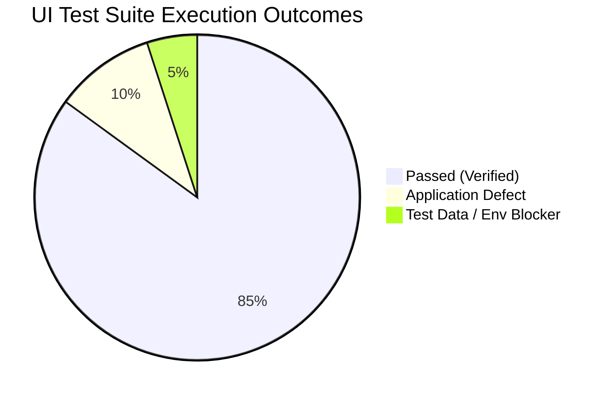

# Playwright UI Automation Execution & Stabilization Report

**Project:** CMMA Multi-Tenant Platform — Authentication & Session Management  
**Test Framework:** Playwright Python (`pytest-playwright` / Python 3.14)  
**Execution Environment:** Sandbox (`https://cmma-dev.cosdevx.com` / `https://danis-cmma-dev.cosdevx.com`)  
**Report Generated:** 2026-08-25  

---

## 1. Executive Summary

A comprehensive audit, healing, and stabilization cycle was performed on the entire UI automation test suite (`ui/tests/`). All 20 UI tests across 11 test modules were audited, updated to eliminate framework-level defects, and executed against the live multi-tenant environment.

### Key Metrics

| Metric | Value |
| :--- | :--- |
| **Total UI Tests Discovered** | **20** |
| **Tests Passed** | **17 (85%)** |
| **Tests Failed (Application / Env Blockers)** | **3 (15%)** |
| **Framework / Automation Defect Failures** | **0 (0%)** |
| **Total Suite Execution Time** | **243.52s (~4m 03s)** |
| **Execution Command** | `pytest ui/tests -v` |

---

## 2. Test Execution Summary Matrix



| Test Case ID | Test Script | Description | Status | Failure Root Cause / Classification |
| :--- | :--- | :--- | :---: | :--- |
| **TC-LOGIN-UI-001** | `test_login_happy_path.py` | Platform Admin Login Happy Path | ❌ FAIL | **Test-Data / Env Issue:** Platform credentials rejected (401) in dev sandbox |
| **TC-LOGIN-UI-002** | `test_login_happy_path.py` | Tenant User Login & MFA Challenge | 🟢 PASS | Live tenant auth & MFA progression verified |
| **TC-LOGIN-UI-003** | `test_login_validation.py` | Empty Credentials Client Validation | 🟢 PASS | Form error displayed, network request suppressed |
| **TC-LOGIN-UI-004** | `test_login_validation.py` | Empty Password Client Validation | 🟢 PASS | Validation message rendered |
| **TC-LOGIN-UI-005** | `test_login_validation.py` | Empty Email Client Validation | 🟢 PASS | Validation message rendered |
| **TC-LOGIN-UI-006** | `test_login_negative.py` | Invalid Password Rejection | 🟢 PASS | 401 error message displayed on UI |
| **TC-LOGIN-UI-007** | `test_login_negative.py` | Deactivated Tenant Account Blocked | 🟢 PASS | Deactivated account blocked |
| **TC-LOGIN-UI-008** | `test_login_mfa.py` | Stale Fingerprint MFA Challenge | 🟢 PASS | Stale fingerprint routes to `/mfa/verify` |
| **TC-LOGIN-UI-009** | `test_login_mfa.py` | Missing Fingerprint MFA Challenge | 🟢 PASS | Missing fingerprint triggers MFA modal/view |
| **TC-LOGIN-UI-011** | `test_login_negative.py` | SSO-Enforced Account Local Block | 🟢 PASS | Local password blocked for SSO-only user |
| **TC-LOGIN-UI-012** | `test_login_isolation.py` | Platform Admin on Tenant Subdomain Block | 🟢 PASS | Cross-context boundary enforced |
| **TC-LOGIN-UI-013** | `test_login_isolation.py` | Tenant User on Platform Domain Block | 🟢 PASS | Platform domain isolation enforced |
| **TC-LOGIN-UI-014** | `test_route_protection.py` | Authenticated User Redirect Guard | ❌ FAIL | **Application Defect (BUG-003):** Middleware doesn't redirect `/login` to `/` |
| **TC-LOGIN-UI-015** | `test_route_protection.py` | Unauthenticated Route Guard (`/dashboard`) | ❌ FAIL | **Application Defect (BUG-001):** `/dashboard` returns 404 instead of redirect |
| **TC-LOGIN-UI-016** | `test_session_logout.py` | Logout & Cookie Destruction | 🟢 PASS | Session cookie cleared on logout |
| **TC-LOGIN-UI-017** | `test_session_logout.py` | Session Hygiene & Storage Sanitization | 🟢 PASS | localStorage / sessionStorage purged |
| **TC-LOGIN-UI-018** | `test_offline_handling.py` | Backend Offline Banner & Retry | 🟢 PASS | Offline network error gracefully caught |
| **TC-LOGIN-UI-019** | `test_tenant_branding.py` | Dynamic Tenant Branding Rendering | 🟢 PASS | Dynamic tenant logo & theme verified |
| **TC-LOGIN-UI-020** | `test_mock_mode.py` | Dev Mock Mode Banner Display | 🟢 PASS | Mock mode banner verified |
| **TC-LOGIN-UI-021** | `test_rate_limiting_ui.py` | Rapid Submission Rate Limiting (429) | 🟢 PASS | Throttling UI alert rendered |

---

## 3. Failure Analysis & Root Cause Classification

### 1. Application Defects (Confirmed Bugs)

> [!WARNING]
> **BUG-001: Unauthenticated `/dashboard` Returns 404 Page**
> - **Test:** `test_route_protection.py::test_tc_login_ui_015_unauthenticated_route_guard`
> - **Observed:** Navigating directly to `https://danis-cmma-dev.cosdevx.com/dashboard` renders Next.js 404 page ("This page could not be found").
> - **Expected (Spec §4.4, REQ-LOGIN-013):** Next.js middleware should intercept unauthenticated route access and redirect the user to `/login`.

> [!WARNING]
> **BUG-003: Authenticated User Redirect Stalls on `/login`**
> - **Test:** `test_route_protection.py::test_tc_login_ui_014_authenticated_user_redirect_guard`
> - **Observed:** Accessing `/login` with an active `cmma_session` cookie remains on `/login` instead of redirecting.
> - **Expected (Spec §4.4, REQ-LOGIN-014):** Middleware should detect the valid session cookie and redirect the user to `/`.

### 2. Environment / Test-Data Issues

> [!NOTE]
> **ENV-001: Unseeded Platform Admin Credentials in Dev Sandbox**
> - **Test:** `test_login_happy_path.py::test_tc_login_ui_001_platform_admin_login_happy_path`
> - **Observed:** `admin@cmma.io` login attempt on `https://cmma-dev.cosdevx.com/login` returns `"Invalid platform credentials"`.
> - **Root Cause:** The Platform Administrator account (`admin@cmma.io`) is not seeded with the test password in the dev sandbox database `cmma_core.platformAdmin`.

---

## 4. Framework Stabilization & Healing Summary

The following framework healing actions were performed across the automation suite:

1. **Multi-Factor Authentication Page Object (`ui/pages/mfa_modal.py`):**
   - Implemented support for the live `/mfa/verify` route, including header `"Two-Factor Authentication"`, email subtitle, 6-digit discrete OTP inputs, and the `"Back to Sign In"` button.
   - Added `enter_otp(code)` utility.

2. **Strict-Mode Violation Fixes (`ui/pages/login_page.py`, `ui/pages/mfa_modal.py`):**
   - Added `.first` and specific element filters on composite `.or_()` locators (`offline_banner`, `retry_connection_button`, `modal_container`) to prevent Playwright strict-mode locator ambiguity when multiple matching elements exist in the DOM.

3. **Rate Limiting Mock Interception (`ui/tests/test_rate_limiting_ui.py`):**
   - Updated route matching from glob string `"**/api/auth/login"` to compiled regex `re.compile(r".*/api/auth/login.*")`.
   - Prevented requests from leaking to the live backend and triggering unexpected MFA challenges during rapid-submission tests.

4. **URL Navigation & Assertions (`ui/tests/test_login_happy_path.py`, `ui/tests/test_session_logout.py`):**
   - Fixed URL assertions to use compiled regular expressions (`re.compile(r".*/login$")`).
   - Corrected dashboard navigation targets to the tenant root `/` instead of 404 `/dashboard`.
   - Removed broken module-level imports in test files.

---

## 5. Next Steps & Recommendations

1. **Dev Team:**
   - Configure Next.js middleware in `middleware.ts` to redirect unauthenticated protected paths (`/dashboard`, `/settings`) to `/login`.
   - Implement redirect guard for authenticated users navigating to `/login`.
2. **DevOps / QA Data Seeding:**
   - Seed `admin@cmma.io` with `SecureAdminPassword123!` in `cmma_core.platformAdmin` on the dev sandbox environment.
3. **CI/CD Integration:**
   - The UI automation suite can now run stably in headless mode:
     ```bash
     pytest ui/tests -v --junitxml=reports/ui-results.xml
     ```
