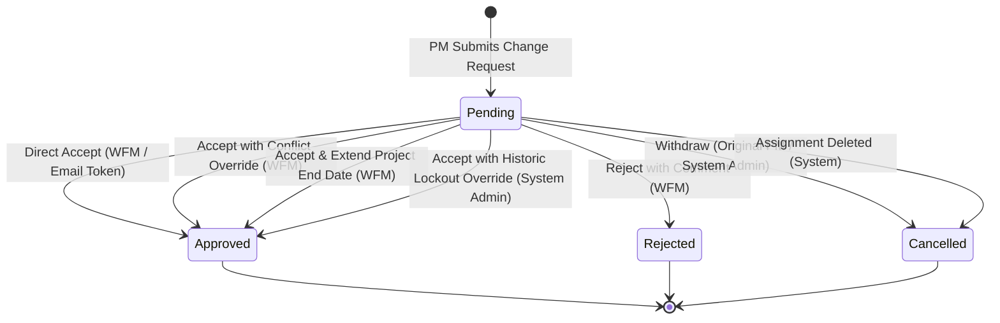

# QA Specification Analysis: Assignment Change Request Approval

**Feature:** `feat-assignment-change-request-approval`  
**Epic:** `epic-assignments`  
**Sources:** `specs/mediumspec1.md` (Functional & UI Specifications) and `specs/mediumspec2.md` (Technical Contract & DB/API Reference)  
**Analysis Date:** 2026-08-25  
**Document Version:** 1.0 (Final Approved)  

---

## 1. Scope / Purpose

The Assignment Change Request Approval feature provides Workforce Managers (WFMs) with a formal, tamper-proof, and audited mechanism to review, validate, and act upon assignment change requests submitted by Project Managers (PMs). 

It enables two primary operational approval pathways:
1. **In-App Workforce Management**: Reviewing and approving/rejecting requests via the Landing Page "Assignment Change Requests" widget and the in-drawer comparison banner on the Assignment Detail panel.
2. **Email Action Links**: Acting on requests directly through secure, time-limited (7-day), HMAC-SHA256 hashed one-click email links.

The feature enforces critical operational constraints (7-day historic lockouts, double-booking / conflict detection, project end date boundaries, and Pursuit/Draft contract blocks) at the moment of approval and updates the underlying assignment lifecycle upon successful resolution.

---

## 2. Actors & Permissions

| Actor / Role | Permissions & Responsibilities | Key Actions |
| :--- | :--- | :--- |
| **Project Manager (PM)** | Responsible for project schedule. Can view assignments and submit assignment change requests. Cannot modify assignments directly. | • Submit change request from Assignment Detail panel<br>• Withdraw own submitted change requests while Pending |
| **Workforce Manager (WFM)** | Responsible for allocating workers across projects. Creates and modifies assignments. | • Review pending requests in Landing Page widget<br>• In-App Accept clean requests, Accept with Conflict Override, Accept & Extend Project End Date<br>• In-App Reject with optional/mandatory comments<br>• Execute email action links (Accept / Deny / View) |
| **System Administrator** | Administrative superuser. | • Approve requests with Historic Lockout Override (>7 days in past)<br>• Withdraw any change request<br>• Full system audit access |
| **System / Automated Service** | Internal lifecycle event processor. | • Automatically cancel pending requests if underlying assignment is deleted<br>• Invalidate action tokens on state transition |

---

## 3. Functional Requirements

| Requirement ID | Description | Source Traceability |
| :--- | :--- | :--- |
| **REQ-ACR-001** | System shall allow PMs to submit change requests proposing modified dates or workers on an assignment. | Spec1 §1, §2 |
| **REQ-ACR-002** | System shall transition new change requests to `Pending` state and dispatch email notifications with action links to WFMs. | Spec1 §2 (Sec 3), Spec2 §2.1 |
| **REQ-ACR-003** | System shall render pending requests in a dedicated Landing Page widget for WFMs. | Spec1 §2 (Sec 6) |
| **REQ-ACR-004** | System shall render a side-by-side comparison banner with PM justification in the Assignment Detail drawer. | Spec1 §2 (Sec 6) |
| **REQ-ACR-005** | WFM shall be able to directly accept clean requests (no conflicts, within project boundary, not historic locked), updating assignment dates. | Spec1 §2 (Sec 3), Spec2 §2.2 (EP4) |
| **REQ-ACR-006** | System shall detect scheduling overlaps with other active assignments for the proposed worker and require explicit WFM conflict override. | Spec1 §2 (Sec 3, 4, 5) |
| **REQ-ACR-007** | System shall detect proposed end dates exceeding project end date and require explicit project end date extension confirmation. | Spec1 §2 (Sec 3, 5) |
| **REQ-ACR-008** | System shall enforce historic lockout on proposed start dates >7 days in past, restricting approval exclusively to System Admins. | Spec1 §2 (Sec 3) |
| **REQ-ACR-009** | WFM shall be able to reject a change request, optionally providing reviewer comments. | Spec1 §2 (Sec 3), Spec2 §2.2 (EP5) |
| **REQ-ACR-010** | PM shall be permitted to withdraw their own pending request; System Admin can withdraw any request. | Spec1 §2 (Sec 3) |
| **REQ-ACR-011** | System shall cancel pending change requests and invalidate tokens if the underlying assignment is deleted. | Spec1 §2 (Sec 3), Spec2 §2.1 |
| **REQ-ACR-012** | System shall validate HMAC-SHA256 email action tokens and allow previewing request details via public token preview endpoint. | Spec2 §2.2 (EP1) |
| **REQ-ACR-013** | System shall execute email action tokens (Accept/Deny) and apply conflict overrides if supplied. | Spec2 §2.2 (EP2) |
| **REQ-ACR-014** | System shall redirect expired email links (>7 days) to landing page with an explicit informational toast. | Spec1 §2 (Sec 4, 5) |
| **REQ-ACR-015** | System shall show dedicated resolved screen indicating resolver name and timestamp when accessing already-resolved email links. | Spec1 §2 (Sec 4) |
| **REQ-ACR-016** | System shall prevent concurrent duplicate approvals, returning "Change request is already resolved" to the second actor. | Spec1 §2 (Sec 4) |

---

## 4. Business Rules & State Machine

### 4.1 State Machine Transitions



### 4.2 Business Rules Matrix

| Rule ID | Category | Condition / Business Rule | Enforcement Mechanism |
| :--- | :--- | :--- | :--- |
| **BR-ACR-001** | Project Status Guard | Approval is strictly blocked if project status is `Pursuit` or `Draft` at time of approval. | Validation: *"Cannot approve workforce assignment on a Pursuit project. Move project to Active status once contract is executed."* |
| **BR-ACR-002** | Self-Collision Exclusion | If proposed worker matches currently assigned worker on the same assignment (date adjustment only), no self-collision is flagged. | System excludes current `assignmentId` from conflict queries. |
| **BR-ACR-003** | Conflict Detection | Proposed worker has an active assignment on a different project during overlapping dates. | Prompts date-by-date breakdown; requires explicit confirmation (`overrideConflict: true`). |
| **BR-ACR-004** | Project Boundary Guard | Proposed end date > project end date. | Prompts confirmation modal; updates both project end date and assignment end date (`extendProjectEndDate: true`). |
| **BR-ACR-005** | Historic Lockout | Proposed start date > 7 days in past. | Blocked for WFM; only System Admin can confirm override (`overrideHistoricLockout: true`). |
| **BR-ACR-006** | Resource State Guard | Proposed worker account is archived or inactive at time of approval. | Blocked: *"Cannot approve: Proposed resource is inactive or archived."* |
| **BR-ACR-007** | Token Expiration | Email action link accessed >7 days after creation. | Link invalidated; redirects to landing page with toast: *"This action link has expired (valid for 7 days). The request can still be reviewed below."* |
| **BR-ACR-008** | Withdrawal Ownership | Only the original PM requester or a System Admin can withdraw a pending request. | Authorization check: `withdrawingUserId === requesterUserId OR userRole === 'SYSTEM_ADMIN'`. |
| **BR-ACR-009** | Concurrency Safety | Two managers attempt approval simultaneously. | First transaction commits; second transaction receives: *"Change request is already resolved."* |

---

## 5. UI Behavior & Controls

### 5.1 Landing Page Widget
- **Placement**: Directly below the "Conflicts" section and directly above "Bench Resources" on the WFM Landing Page.
- **Table Columns**: Worker Name, Trade, Proposed Date Range, Project Name, Actions ("Review" link).
- **Interactions**: Clicking "Review" opens the Assignment Detail drawer for that specific request.

### 5.2 Assignment Detail Drawer — Comparison Banner
- **Visual Style**: Amber background indicating attention required.
- **Banner Header**: `"CHANGE REQUEST PENDING REVIEW"` with requester name aligned right.
- **Comparison View**: Side-by-side comparison of Current Worker & Dates vs. Proposed Worker & Dates.
- **Justification**: Quoted display of PM's written justification.
- **Alert Badges**:
  - 🟨 Amber Badge: `"Scheduling Conflict / Time-Off Detected"`
  - 🟦 Blue Badge: `"Extends Project End Date"`
  - ⬜ Grey Badge: `"Historic Lockout Threshold"`
- **Actions**:
  - Red `"Reject"` Button → Opens rejection comment dialog.
  - Green/Amber `"Accept Changes"` Button → Direct approval or triggers specific confirmation modal.

### 5.3 Confirmation Modals
1. **Scheduling Conflict Modal**: Header `"Scheduling Conflict Detected"`, lists overlapping dates, button `"Override and Accept"`.
2. **Project Extension Modal**: Header `"Extend Project End Date?"`, prompts confirmation, button `"Extend Project and Accept"`.
3. **Rejection Dialog**: Comment input textarea, buttons `"Cancel"` and `"Confirm Rejection"`.

---

## 6. Validation & Error Messages

| Validation ID | Scenario | Expected Error / Toast / Message |
| :--- | :--- | :--- |
| **VAL-ACR-001** | Pursuit / Draft Project Approval | `"Cannot approve workforce assignment on a Pursuit project. Move project to Active status once contract is executed."` |
| **VAL-ACR-002** | Inactive / Archived Resource Approval | `"Cannot approve: Proposed resource is inactive or archived."` |
| **VAL-ACR-003** | Expired Email Action Link | Toast: `"This action link has expired (valid for 7 days). The request can still be reviewed below."` |
| **VAL-ACR-004** | Already Resolved Request Link | Dedicated screen displaying resolver name and resolution timestamp. |
| **VAL-ACR-005** | Concurrent Resolution Race Condition | `"Change request is already resolved."` |
| **VAL-ACR-006** | Unauthorized Withdrawal Attempt | Access Denied / 403 Forbidden on non-owner PM withdrawal. |

---

## 7. Authentication, Authorization & Security

### 7.1 In-App Authentication
- Standard Bearer JWT required for all in-app endpoints (`/api/workforce/assignment-change-requests/*`).
- Role-Based Access Control (RBAC):
  - `PM`: Submit / Withdraw Own.
  - `WFM`: Review / Accept / Reject / Override Conflicts / Extend Project.
  - `SYSTEM_ADMIN`: Historic Lockout Override / Withdraw Any.

### 7.2 Email Action Token Security
- **Algorithm**: HMAC-SHA256 hex digest (`tokenHash` stored in DB; plain token transmitted in link).
- **Token Actions**: `'ACCEPT'`, `'DENY'`, `'VIEW'`.
- **Expiration**: Strict 7-day TTL (`expiresAt = createdDateTime + 7 days`).
- **Single-Use**: `usedAt` set upon execution; subsequent invocations rejected.
- **Cascade Deletion**: Tokens cascade-deleted on `changeRequestId` deletion.

---

## 8. APIs & Data Contracts

| Method | Endpoint | Auth | Request Body | Success Response | Error Codes |
| :--- | :--- | :--- | :--- | :--- | :--- |
| `GET` | `/api/workforce/assignment-change-requests/token-preview` | Public (Token query) | `?token=string` | 200 OK: `{ valid, changeRequestId, action, projectName, workerName, tradeName, currentDates, proposedDates, currentHoursPerDay, proposedHoursPerDay, requesterName, requesterComments, hasConflict, conflictDetails, extendsProject, isHistoricLocked }` | 400 Bad Request, 404 Not Found, 410 Gone (Expired) |
| `POST` | `/api/workforce/assignment-change-requests/execute-token` | Public (Token body) | `{ token, overrideConflict, reviewerComments }` | 200 OK: `{ success: true, changeRequestId, assignmentId, status: "APPROVED", message }` | 400 Bad Request, 409 Conflict, 410 Expired |
| `GET` | `/api/workforce/assignment-change-requests` | Bearer JWT | Query: `?status=PENDING&projectId=...&limit=10&offset=0` | 200 OK: `{ items: [...], total, limit, offset }` | 401 Unauthorized, 403 Forbidden |
| `PATCH` | `/api/workforce/assignment-change-requests/:changeRequestId/approve` | Bearer JWT | `{ overrideConflict, overrideHistoricLockout, extendProjectEndDate }` | 200 OK: `{ success: true, changeRequestId, assignmentId, status: "APPROVED" }` | 400 Validation Error, 403 Forbidden, 409 State Conflict |
| `PATCH` | `/api/workforce/assignment-change-requests/:changeRequestId/reject` | Bearer JWT | `{ reviewerComments }` | 200 OK: `{ success: true, changeRequestId, status: "REJECTED" }` | 400 Bad Request, 403 Forbidden, 409 State Conflict |

---

## 9. Database Entities & Schema

```sql
-- 1. assignmentChangeRequestToken Table
CREATE TABLE IF NOT EXISTS "${schemaName}"."assignmentChangeRequestToken" (
    "tokenId" UUID PRIMARY KEY DEFAULT gen_random_uuid(),
    "changeRequestId" UUID NOT NULL REFERENCES "${schemaName}"."assignmentChangeRequest"("changeRequestId") ON DELETE CASCADE,
    "action" VARCHAR(20) NOT NULL, -- 'ACCEPT', 'DENY', 'VIEW'
    "tokenHash" VARCHAR(64) NOT NULL, -- HMAC-SHA256 hex digest
    "recipientUserId" UUID NULL REFERENCES "${schemaName}"."account"("accountId") ON DELETE SET NULL,
    "expiresAt" TIMESTAMPTZ NOT NULL,
    "usedAt" TIMESTAMPTZ NULL,
    "createdDateTime" TIMESTAMPTZ NOT NULL DEFAULT NOW()
);

-- Indexes
CREATE INDEX IF NOT EXISTS "idx_acr_token_hash" 
ON "${schemaName}"."assignmentChangeRequestToken" ("tokenHash");

CREATE INDEX IF NOT EXISTS "idx_acr_token_request_action" 
ON "${schemaName}"."assignmentChangeRequestToken" ("changeRequestId", "action");

-- 2. Indexes on assignmentChangeRequest
CREATE INDEX IF NOT EXISTS "idx_assignmentChangeRequest_status_created"
ON "${schemaName}"."assignmentChangeRequest" ("status", "createdDateTime" DESC);

CREATE INDEX IF NOT EXISTS "idx_assignmentChangeRequest_assignment_status"
ON "${schemaName}"."assignmentChangeRequest" ("assignmentId", "status");
```

---

## 10. Security, Rate Limits & Tenant Isolation

1. **Multi-Tenant Schema Isolation**: All queries and DDL dynamically scoped to `${schemaName}` (e.g. `cmma_danis`).
2. **Token Security**: Tokens are generated using cryptographic random sources and stored as HMAC-SHA256 digests. Raw tokens cannot be extracted from database dumps.
3. **Audit Trail**: Every state transition logs reviewer identity, timestamp, and optional override flags (`conflictOverride`, `historicLockoutOverride`, `extendProjectEndDate`).
4. **Rate Limiting**: Recommended rate limiting on public token endpoints to prevent brute-force token scanning.

---

## 11. Errors, Dependencies & Integration Points

1. **Email Service**: Transmit transactional emails containing HMAC token URLs. Dependency on SMTP/SendGrid infrastructure.
2. **Notification Engine**: In-app notifications to PM on approval, rejection, or cancellation.
3. **Core Assignment Engine**: State propagation from `assignmentChangeRequest` to underlying `assignment` and `project` records.

---

## 12. Risks & Regression Impact

| Risk ID | Description | Severity | Mitigation Strategy |
| :--- | :--- | :---: | :--- |
| **RISK-ACR-001** | Accidental double-booking of high-demand workers via one-click email token execution without seeing conflict details. | High | Token Preview endpoint (`GET /token-preview`) returns `hasConflict: true` and conflict breakdown before execution; execute endpoint requires `overrideConflict: true`. |
| **RISK-ACR-002** | Unintended project extension altering commercial project schedules. | Medium | Mandatory explicit confirmation (`extendProjectEndDate: true`) before project date modification. |
| **RISK-ACR-003** | Race conditions during concurrent approval by multiple WFM managers. | High | DB row-level locking / optimistic concurrency on `assignmentChangeRequest` state update. |
| **RISK-ACR-004** | Regression in core assignment scheduling and calendar views when dates are modified via ACR approval. | High | Comprehensive regression suite across Assignment Detail, Timeline, and Calendar. |

---

## 13. Ambiguities & Information Gaps

> [!NOTE]
> **GAP-ACR-001**: Notification payload format and email template when WFM rejects a request without providing reviewer comments.  
> **GAP-ACR-002**: UI badge count indicator on the Landing Page widget when new requests arrive.  
> **GAP-ACR-003**: Exact behavior if PM submits a second change request while a pending request already exists on the same assignment (expected: blocked, but not explicitly specified in spec extract).
