# QA Master Test Plan: Assignment Change Request Approval

**Feature:** `feat-assignment-change-request-approval`  
**Epic:** `epic-assignments`  
**Target Release:** Current Sprint  
**QA Reference:** `QA_Assignment_Change_Request_Approval/analysis/AssignmentChangeRequest_QA_Analysis.md`  
**Document Version:** 2.0 (Revised — Gap Analysis Applied)  

---

## 1. Objective

Define the master test strategy, coverage scope, quality gates, and risk management approach for verifying the **Assignment Change Request Approval** feature across In-App WFM workflows, Email Action Token lifecycles, operational constraint checks, database data integrity, and security controls.

---

## 2. Scope

### In-Scope
1. **In-App Workflow Verification**:
   - Landing Page "Assignment Change Requests" widget rendering, column validation, and drawer launch.
   - Assignment Detail panel side-by-side comparison banner, PM justification, and alert badges.
   - Clean approval, Conflict override approval, Project extension approval, Historic lockout approval.
   - In-app rejection with reviewer comments dialog.
   - PM request withdrawal and System Admin withdrawal.
   - Deletion of underlying assignment triggering automatic cancellation and token invalidation.
2. **Email Action Token Verification**:
   - Validation of `GET /api/workforce/assignment-change-requests/token-preview`.
   - Execution of `POST /api/workforce/assignment-change-requests/execute-token`.
   - Full token lifecycle: Created → Unused → Preview → Execute → `usedAt` populated → Reuse rejected.
   - 7-day token expiration handling and redirect to landing page with toast.
   - Already-resolved dedicated screen with resolver name and timestamp.
   - Security: token tampering, replay, reuse, cross-tenant, malformed, and missing token scenarios.
3. **Operational & Security Constraints**:
   - Pursuit / Draft project status blocking approval.
   - Inactive / Archived resource blocking approval.
   - Self-collision exclusion (dates changed for same worker does NOT trigger conflict).
   - Real external assignment overlap conflict detection.
   - Concurrency safety: simultaneous in-app approvals, simultaneous email token executions, and mixed UI + email simultaneous approval.
   - Multi-tenant data isolation: cross-tenant token access and cross-tenant API query isolation.
   - RBAC permission enforcement per role (PM, WFM, System Admin).
4. **State Machine Integrity**:
   - All valid state transitions: Pending → Approved, Pending → Rejected, Pending → Cancelled.
   - All invalid state transitions: Approved/Rejected/Cancelled → any action (must return 409).
5. **Database & Schema Integrity**:
   - `assignmentChangeRequestToken` table structure, indexes, and cascade deletion.
   - Index verification on `assignmentChangeRequest` (`status`, `createdDateTime`, `assignmentId`).
   - Data integrity after every state transition: status, dates, audit record, token `usedAt`.
6. **Audit Trail Verification**:
   - Audit record created for Approve, Reject, Withdraw, and Auto-cancel with correct fields.
7. **Notification Verification**:
   - Notification events generated on Pending, Approve, Reject, Withdraw, and Auto-cancel.
   - Correct WFM recipient and action token content on submission.
8. **Pagination & Filtering** (List endpoint):
   - Status filter, project filter, limit/offset, zero results, large offset, invalid parameters.
9. **Accessibility**:
   - Keyboard navigation, focus management in modals, accessible button names, label associations, screen-reader semantics.
10. **Performance Indicators**:
    - Widget response time, token preview response time, pagination with large datasets.

### Out-of-Scope
- Submission of original assignment change requests (covered under `feat-assignment-change-request-submission`).
- Core assignment creation from scratch (covered under `feat-assignment-management`).
- Email delivery infrastructure / SMTP load testing (mocked via token validation endpoints).

---

## 3. Requirements Traceability Matrix

> [!IMPORTANT]
> This matrix is the primary mechanism for answering "Have we tested every requirement?" It must be kept updated as test cases are written.

| Requirement ID | Description | Test Area | Test Type | Automation |
| :--- | :--- | :--- | :--- | :--- |
| **REQ-ACR-001** | PM submits change request | Request submission | Functional | Out of scope (submission feature) |
| **REQ-ACR-002** | New request → Pending state + email notification dispatched with correct WFM recipient and action tokens | Pending state, notification event, token generation | Functional / API | API (status), Manual (notification) |
| **REQ-ACR-003** | Landing Page widget renders pending requests | Widget rendering | UI | Playwright |
| **REQ-ACR-004** | Assignment Detail drawer comparison banner | Drawer banner | UI | Playwright |
| **REQ-ACR-005** | Clean direct approval updates assignment dates | Approval flow | UI / API / DB | Playwright + Pytest |
| **REQ-ACR-006** | Conflict detection + explicit override required | Conflict override | UI / API / DB | Playwright + Pytest |
| **REQ-ACR-007** | Proposed end date > project end → project extension | Project extension | UI / API / DB | Playwright + Pytest |
| **REQ-ACR-008** | Historic lockout (>7 days past) → System Admin only | Historic lockout | UI / API | Playwright + Pytest |
| **REQ-ACR-009** | WFM rejection with optional comments | Rejection flow | UI / API / DB | Playwright + Pytest |
| **REQ-ACR-010** | PM withdrawal (own only), System Admin withdrawal (any) | Withdrawal flow | UI / API | Playwright + Pytest |
| **REQ-ACR-011** | Assignment deletion → auto-cancel pending request AND invalidate tokens | Auto-cancel + token invalidation | API / DB | Pytest + SQL |
| **REQ-ACR-012** | HMAC token preview endpoint — validate and return request details | Token preview | API | Pytest |
| **REQ-ACR-013** | HMAC token execute endpoint — Accept/Deny with optional conflict override | Token execution | API | Pytest |
| **REQ-ACR-014** | Expired token (>7 days) → landing page redirect + toast | Token expiration | API / UI | Pytest + Playwright |
| **REQ-ACR-015** | Already-resolved request → dedicated resolved screen | Resolved screen | UI | Playwright |
| **REQ-ACR-016** | Concurrent approval → single winner, second gets 409 | Concurrency | API / DB | Pytest (concurrent) |

---

## 4. Business Rule Coverage Matrix

| Business Rule | Description | Covered By | Status |
| :--- | :--- | :--- | :--- |
| **BR-ACR-001** | Pursuit/Draft project blocks approval | `TC-GUARD-001` | ✓ |
| **BR-ACR-002** | Self-collision exclusion (same worker, same assignment) | `TC-GUARD-003` | ✓ |
| **BR-ACR-003** | Conflict detection requires `overrideConflict: true` | `TC-CONFLICT-001..003` | ✓ |
| **BR-ACR-004** | End date > project boundary requires `extendProjectEndDate: true` | `TC-EXT-001..002` | ✓ |
| **BR-ACR-005** | Historic lockout >7 days — WFM blocked, System Admin only | `TC-HIST-001..003` | ✓ |
| **BR-ACR-006** | Inactive/archived resource blocks approval | `TC-GUARD-002` | ✓ |
| **BR-ACR-007** | Token expiration at 7-day boundary | `TC-TOKEN-EXP-001..002` | ✓ |
| **BR-ACR-008** | Withdrawal ownership — only requester PM or System Admin | `TC-WITH-002..003` | ✓ |
| **BR-ACR-009** | Concurrency — second actor receives "already resolved" | `TC-CONC-001..003` | ✓ |

---

## 5. Features to Test

| Feature Area | Sub-Features & Components | Target Layer |
| :--- | :--- | :--- |
| **Landing Page Widget** | Widget placement, row rendering, review link trigger, pagination | UI, API |
| **Drawer Comparison Banner** | Side-by-side comparison, PM comments, Alert badges (🟨, 🟦, ⬜), accessibility | UI |
| **Direct Approval** | Clean request approval, assignment dates update, token invalidation, audit record | UI, API, DB |
| **Conflict Override** | Overlap detection modal, date-by-date breakdown, override flag, audit record | UI, API, DB |
| **Project Extension** | End date boundary check, confirmation modal, project date update, audit record | UI, API, DB |
| **Historic Lockout** | >7 day past threshold, System Admin exclusive override | UI, API, DB |
| **Rejection Flow** | Comment capture dialog, state transition to `Rejected`, PM notify, audit record | UI, API, DB |
| **Withdrawal Flow** | Requester PM withdrawal, non-requester block, Admin override, notification | UI, API, DB |
| **Email Action Links** | Token lifecycle, token security, 7-day expiry toast, resolved view | API, UI |
| **State Machine Guards** | Invalid transition rejection (Approved → any, Rejected → any, Cancelled → any) | API |
| **RBAC Enforcement** | Permission matrix per role across all actions | UI, API |
| **Multi-tenancy** | Cross-tenant token access, cross-tenant API query isolation | API, DB |
| **Concurrency** | Simultaneous in-app, simultaneous email token, mixed UI+email | API, DB |
| **Audit Trail** | Audit record creation and field correctness after every state transition | DB |
| **Notification Events** | Notification payload and recipient correctness | API |
| **Pagination/Filtering** | Status/project filter, limit/offset, boundary values | API |
| **Accessibility** | Keyboard nav, focus management, ARIA labels, color contrast | UI |
| **Regression** | Assignment Detail, Timeline, Calendar, worker availability, conflict calculations | UI, API, DB |

---

## 6. Test Strategy

```mermaid
graph TD
    A[QA Master Test Strategy] --> B[UI Layer / Playwright]
    A --> C[API Layer / Pytest + Requests]
    A --> D[DB Layer / SQL Verification]
    A --> E[Regression Suite]
    A --> F[Security / Token Tests]
    A --> G[Accessibility Tests]

    B --> B1[Landing Page Widget & Drawer Banner]
    B --> B2[Modal Dialogs & Error Toasts]
    B --> B3[RBAC Permission Flows]
    B --> B4[State Machine UI Guards]
    B --> B5[Accessibility & Keyboard Navigation]

    C --> C1[API Contract Testing — Pydantic Schema Validation]
    C --> C2[API Business-Rule Testing — Per Endpoint]
    C --> C3[HMAC Token Lifecycle & Security]
    C --> C4[Negative / Boundary Payloads]
    C --> C5[Pagination & Filtering]
    C --> C6[Concurrency — Parallel Requests]

    D --> D1[assignmentChangeRequestToken Schema & DDL]
    D --> D2[Index & Cascade Constraint Integrity]
    D --> D3[Data Integrity After State Transitions]
    D --> D4[Audit Record Field Verification]

    E --> E1[Assignment Detail / Timeline / Calendar Regression]
    E --> E2[Worker Availability & Conflict Calculation Regression]

    F --> F1[Token Tampering / Replay / Reuse]
    F --> F2[Cross-tenant Token Access]
    F --> F3[RBAC Privilege Escalation Attempts]
```



### 6.1 Functional & UI Testing
- Verify full user journeys from Landing page widget and drawer banner.
- Validate dynamic badge rendering (Conflict, Project Extension, Historic Lockout).
- Confirm modal confirmation sequences for overrides and extensions.
- Verify accessible rendering: keyboard navigation, focus trapping in modals, ARIA roles, label associations.

### 6.2 API Testing — Contract vs. Business Rule (Distinct)

> [!NOTE]
> API Contract Testing and API Business-Rule Testing serve different purposes and must be run as separate test suites.

**API Contract Testing** — validates the API schema surface:
- `overrideConflict` must be Boolean (not string `"YES"`)
- `reviewerComments` must be a string or null, not integer
- Required fields must be present; unknown fields rejected or ignored per spec
- Response body matches Pydantic-defined schema on all 5 endpoints

**API Business-Rule Testing** — validates the behavioral logic:
- `overrideConflict: true` is required and accepted only when a conflict actually exists
- `overrideHistoricLockout: true` is accepted only from `SYSTEM_ADMIN` role
- `extendProjectEndDate: true` updates both assignment and project records
- Token expiration at exactly 7 days (boundary on both sides)

Automated test coverage of all 5 endpoints defined in `mediumspec2.md`:
1. `GET /token-preview`
2. `POST /execute-token`
3. `GET /assignment-change-requests` (list + filter + pagination)
4. `PATCH /:changeRequestId/approve`
5. `PATCH /:changeRequestId/reject`

### 6.3 Database Testing (SQL Verification)
- Verify `assignmentChangeRequestToken` schema, foreign key constraints (`ON DELETE CASCADE`, `ON DELETE SET NULL`), and default timestamps.
- Validate query optimization against defined indexes.
- **Data integrity checks after every state transition** (see Section 19).

### 6.4 Positive, Negative & Boundary Testing
- **Positive**: Clean approval, valid token preview, successful withdrawal, valid pagination.
- **Negative**: Blocked approval on Pursuit projects, archived workers, non-owner withdrawal 403, invalid/tampered/expired tokens, invalid API payloads.
- **Boundary**: Exactly 7-day token expiration (day 6 valid, day 7 boundary, day 8 expired). Exactly 7-day past start date historic threshold.

---

## 7. RBAC Permission Matrix

> [!IMPORTANT]
> Items marked `?` must be clarified from the source specification before test case generation. These represent authorization ambiguities that could mask privilege escalation defects.

| Action | PM | WFM | System Admin | Notes |
| :--- | :---: | :---: | :---: | :--- |
| View pending requests widget | ✗ | ✓ | ✓ | WFM-only landing page |
| Open drawer comparison banner | ✓ (own project) | ✓ | ✓ | PM view-only |
| Accept clean request | ✗ | ✓ | ✓ | |
| Accept with conflict override | ✗ | ✓ | ✓ | Requires `overrideConflict: true` |
| Accept with project extension | ✗ | ✓ | ✓ | Requires `extendProjectEndDate: true` |
| Accept with historic lockout override | ✗ | ✗ | ✓ | System Admin exclusive |
| Reject request | ✗ | ✓ | ✓ | |
| Withdraw own submitted request | ✓ | ? | ✓ | WFM withdrawal of own? — clarify |
| Withdraw any request | ✗ | ? | ✓ | WFM withdrawal of others? — clarify |
| Execute email ACCEPT token | — | ✓ | ✓ | Token-based; no in-app role check on public endpoint |
| Execute email DENY token | — | ✓ | ✓ | Token-based |
| List all change requests via API | ✗ | ✓ | ✓ | 403 for PM |
| Access audit trail | ✗ | ? | ✓ | Clarify WFM audit access |

**RBAC Test Scenarios to Automate:**
- PM attempts to call `PATCH /approve` → expect 403.
- PM attempts to call `PATCH /reject` → expect 403.
- WFM attempts `overrideHistoricLockout: true` → expect 403.
- Non-owner PM calls withdraw → expect 403.
- Unauthenticated request to JWT-protected endpoint → expect 401.

---

## 8. Test Data Requirements

| Data Entity | Required States / Profiles | Purpose |
| :--- | :--- | :--- |
| **Projects** | Active Project (`Meals on Wheels`, end: `2026-10-01`); Pursuit Project; Draft Project | Verify boundary & project status guards |
| **Workers / Resources** | Active Concrete Worker (`Cody Kessler`); Worker with active overlapping assignment; Archived / Inactive Worker | Verify clean vs. conflict vs. archived guards |
| **Change Requests** | Clean Pending Request; Conflict Pending Request; Project Extension Pending Request (`end: 2026-11-15`); Historic Lockout Request (`start: >7 days in past`); Resolved (Approved) Request; Resolved (Rejected) Request; Cancelled Request | Test all state machine transition branches and invalid transitions |
| **Action Tokens** | Valid Unused HMAC-SHA256 Token; Expired Token (`createdDateTime: 8 days ago`); Token at Boundary (`createdDateTime: exactly 7 days ago`); Used Token (`usedAt` populated); Tampered Token (hash modified); DENY action token; VIEW action token; Token for deleted/cancelled request; Token from a different tenant | Verify full token lifecycle and security scenarios |
| **Tenants** | Tenant A with its own request + token; Tenant B with its own request + token | Cross-tenant isolation testing |
| **Concurrent Actors** | WFM User 1 + WFM User 2 sessions; WFM session + valid ACCEPT token | Concurrency and race condition testing |

---

## 9. Environment & Dependencies

- **Target System**: CMMA Workforce Management Application (Web Frontend & Node/TypeScript Backend).
- **Tenant Context**: Multi-tenant database schema (`cmma_danis` or dynamic test tenant).
- **Authentication**: JWT Bearer token authentication for in-app endpoints; HMAC-SHA256 public query for email links.
- **Dependencies**: Email notification engine, core assignment service.

---

## 10. Automation Strategy

- **UI Automation**: Playwright Python with Page Object Model (`BasePage`, `LandingPageWidget`, `AssignmentDetailDrawer`, `TokenActionPage`).
- **API Automation**: Pytest + Requests with Pydantic contract schemas. Separate test modules for contract tests and business-rule tests.
- **DB Verification**: Manual SQL script execution and verification matrix. No automated DB scripts generated.
- **Concurrency Testing**: Python `threading` or `asyncio` within Pytest to fire parallel API requests and verify single-winner behavior.
- **Accessibility**: Playwright `expect(locator).to_be_focused()` assertions, ARIA attribute checks, and Axe-core integration for automated accessibility scanning.

### Browser & Responsive Coverage

| Browser | Desktop | Tablet | Notes |
| :--- | :---: | :---: | :--- |
| Chromium | ✓ | ✓ | Primary automation target |
| Firefox | ✓ | — | Secondary smoke pass |
| WebKit (Safari) | ✓ | — | Secondary smoke pass |
| Mobile/Responsive | Manual only | — | Widget & drawer responsive layout |

---

## 11. Test Priority Definitions

> [!IMPORTANT]
> Exit criteria reference P1 and P2. Priority definitions must be agreed before test case generation begins.

### P0 — Critical (Security / Data-Loss / Business-Critical)
Failures at this level are release blockers regardless of quantity.

| Scenario | Reason |
| :--- | :--- |
| Unauthorized approval (PM calls `/approve`) | Privilege escalation |
| Cross-tenant token execution (Tenant B uses Tenant A's token) | Data breach |
| Double approval allowed (concurrent WFM 1 + WFM 2) | Data corruption |
| Double booking created by approval | Scheduling integrity |
| Token forgery accepted (tampered hash) | Security bypass |
| Historic lockout bypassed by WFM | Business rule bypass |
| Token reuse accepted after `usedAt` populated | Security bypass |

### P1 — High (Core Feature Functionality)
Failures at this level must be resolved before release.

| Scenario |
| :--- |
| Clean approval — assignment dates updated |
| Conflict override approval |
| Project extension approval |
| Rejection with comments |
| PM withdrawal of own request |
| Token preview returns correct details |
| Token execute — Accept |
| Token execute — Deny |
| Token expiration → redirect + toast |
| Already-resolved screen displayed |
| Assignment deletion → auto-cancel + token invalidation |
| Pursuit/Draft project block |
| Inactive/archived resource block |

### P2 — Medium (UI, UX, Secondary Behavior)
Failures at this level should be resolved before release but are not hard blockers.

| Scenario |
| :--- |
| Widget row rendering and column display |
| Alert badge display (Conflict, Extension, Historic) |
| Rejection comment textarea label and accessibility |
| Badge accessibility (color not sole indicator) |
| Pagination: limit/offset behavior |
| Zero results state |
| Resolved screen formatting |
| Browser compatibility (Firefox, WebKit) |

---

## 12. Token Lifecycle & Security Testing

### 12.1 Token Lifecycle Flow

```
Created
 ↓
Unused (valid, not expired)
 ↓
Preview (GET /token-preview) → returns details, token still valid
 ↓
Execute (POST /execute-token) → action applied, usedAt populated
 ↓
Reuse attempt → 409 Conflict (already resolved)
```

### 12.2 Token Test Matrix

| Token State | Test ID | Expected Outcome |
| :--- | :--- | :--- |
| Valid, unused | `TC-TOKEN-001` | 200 — preview details returned |
| Valid, unused — ACCEPT | `TC-TOKEN-002` | 200 — request approved |
| Valid, unused — DENY | `TC-TOKEN-003` | 200 — request rejected |
| Valid, unused — VIEW | `TC-TOKEN-004` | 200 — preview details returned (no action) |
| Expired (>7 days) | `TC-TOKEN-EXP-001` | 410 Gone + toast redirect |
| At boundary (exactly 7 days) | `TC-TOKEN-EXP-002` | Clarify: valid or expired (document result) |
| Already used (`usedAt` set) | `TC-TOKEN-USED-001` | 409 Conflict |
| Tampered hash | `TC-TOKEN-SEC-001` | 400 Bad Request |
| Wrong tenant | `TC-TOKEN-SEC-002` | 404 Not Found / 403 Forbidden |
| Deleted request (CASCADE) | `TC-TOKEN-SEC-003` | 404 Not Found |
| Wrong action type | `TC-TOKEN-SEC-004` | 400 Bad Request |
| Missing token field | `TC-TOKEN-SEC-005` | 400 Bad Request |
| Empty token string | `TC-TOKEN-SEC-006` | 400 Bad Request |
| Extremely long token (>1000 chars) | `TC-TOKEN-SEC-007` | 400 Bad Request |
| Malformed token (not hex) | `TC-TOKEN-SEC-008` | 400 Bad Request |
| Token after request cancellation | `TC-TOKEN-SEC-009` | 409 / 410 |
| Token after request rejection | `TC-TOKEN-SEC-010` | 409 Conflict |
| Token after request approval | `TC-TOKEN-SEC-011` | 409 Conflict |
| Token for another change request | `TC-TOKEN-SEC-012` | 404 / 400 |

---

## 13. State Machine Testing

### 13.1 Valid Transitions (Must Succeed)

| From State | Action | Expected Outcome |
| :--- | :--- | :--- |
| `PENDING` | WFM Accept (clean) | `APPROVED` — assignment updated |
| `PENDING` | WFM Accept + conflict override | `APPROVED` — conflict recorded |
| `PENDING` | WFM Accept + project extension | `APPROVED` — project end updated |
| `PENDING` | System Admin Accept + historic override | `APPROVED` |
| `PENDING` | WFM Reject | `REJECTED` — comment stored |
| `PENDING` | PM Withdraw (own) | `CANCELLED` |
| `PENDING` | System Admin Withdraw | `CANCELLED` |
| `PENDING` | Assignment deleted | `CANCELLED` (auto) — tokens invalidated |
| `PENDING` | Email ACCEPT token | `APPROVED` |
| `PENDING` | Email DENY token | `REJECTED` |

### 13.2 Invalid Transitions (Must Return 409)

> [!IMPORTANT]
> These invalid-transition tests are among the most important state integrity checks. Each must return HTTP 409 with an appropriate error message.

| From State | Attempted Action | Expected HTTP | Expected Message |
| :--- | :--- | :--- | :--- |
| `APPROVED` | Approve again | 409 | "Change request is already resolved" |
| `APPROVED` | Reject | 409 | "Change request is already resolved" |
| `APPROVED` | Withdraw | 409 | "Change request is already resolved" |
| `APPROVED` | Execute email ACCEPT token | 409 | "Change request is already resolved" |
| `REJECTED` | Approve | 409 | "Change request is already resolved" |
| `REJECTED` | Reject again | 409 | "Change request is already resolved" |
| `REJECTED` | Withdraw | 409 | "Change request is already resolved" |
| `CANCELLED` | Approve | 409 | "Change request is already resolved" |
| `CANCELLED` | Reject | 409 | "Change request is already resolved" |
| `CANCELLED` | Execute email ACCEPT token | 409 / 410 | Already resolved or token gone |

---

## 14. Concurrency Testing

### Scenario 1: Dual WFM In-App Approval
```
WFM 1 → PATCH /approve  ┐ simultaneous
WFM 2 → PATCH /approve  ┘

Expected:
  WFM 1 → 200 APPROVED
  WFM 2 → 409 "Change request is already resolved"
```

### Scenario 2: UI Approval + Email Token Execution
```
WFM → PATCH /approve           ┐ simultaneous
Email ACCEPT token → /execute  ┘

Expected:
  First request  → 200 APPROVED
  Second request → 409 "Change request is already resolved"
```

### Scenario 3: Dual Email Token Execution
```
Token ACCEPT (request 1) → /execute  ┐ simultaneous
Token ACCEPT (request 2) → /execute  ┘

Expected:
  First execution  → 200 APPROVED
  Second execution → 409 Conflict (already resolved)

Verify: Assignment dates updated exactly once.
```

---

## 15. Multi-Tenancy Isolation Testing

### Data Model
```
Tenant A
  └── Request A (changeRequestId: UUID-A)
  └── Token A (tokenHash: HASH-A)

Tenant B
  └── Request B (changeRequestId: UUID-B)
  └── Token B (tokenHash: HASH-B)
```

### Test Scenarios

| Test ID | Scenario | Expected |
| :--- | :--- | :--- |
| `TC-MT-001` | Tenant B uses Token A (`/execute-token`) | 404 Not Found / 403 Forbidden |
| `TC-MT-002` | Tenant B queries `/assignment-change-requests` with Tenant A's JWT | Returns only Tenant B's records (or 403) |
| `TC-MT-003` | Tenant B calls `PATCH /approve` with Tenant A's `changeRequestId` | 404 Not Found |
| `TC-MT-004` | Tenant A's token preview (`/token-preview?token=TOKEN-A`) using Tenant B headers | 404 Not Found |
| `TC-MT-005` | DB query: Tenant A's schema contains no Tenant B records after Tenant B actions | 0 rows from Tenant A schema |

---

## 16. Negative API Testing

### 16.1 Approve Endpoint — Invalid Payloads

| Test ID | Payload | Expected |
| :--- | :--- | :--- |
| `TC-NEG-APP-001` | `overrideConflict: "YES"` (string instead of boolean) | 400 Validation Error |
| `TC-NEG-APP-002` | `overrideHistoricLockout: 1` (integer instead of boolean) | 400 Validation Error |
| `TC-NEG-APP-003` | `extendProjectEndDate: null` | 400 / ignored (document behavior) |
| `TC-NEG-APP-004` | Missing all fields `{}` | 200 clean approval if no flags needed, else 400 |
| `TC-NEG-APP-005` | Unexpected field `{"unknownField": true}` | Ignored (document behavior) |
| `TC-NEG-APP-006` | Invalid `changeRequestId` (not UUID) | 400 Bad Request |
| `TC-NEG-APP-007` | Non-existent `changeRequestId` (valid UUID format) | 404 Not Found |

### 16.2 Reject Endpoint — Invalid Payloads

| Test ID | Payload | Expected |
| :--- | :--- | :--- |
| `TC-NEG-REJ-001` | `reviewerComments: 12345` (integer) | 400 Validation Error |
| `TC-NEG-REJ-002` | `reviewerComments: null` | 200 (comments optional — verify) |
| `TC-NEG-REJ-003` | `reviewerComments: ""` (empty string) | 200 or 400 (document expected behavior — **GAP-PLAN-001**) |
| `TC-NEG-REJ-004` | `reviewerComments: <5000-char string>` | 200 or 400 (document max length behavior) |

### 16.3 Execute Token Endpoint — Invalid Payloads

| Test ID | Payload | Expected |
| :--- | :--- | :--- |
| `TC-NEG-TOK-001` | Missing `token` field | 400 Bad Request |
| `TC-NEG-TOK-002` | `token: null` | 400 Bad Request |
| `TC-NEG-TOK-003` | `token: ""` | 400 Bad Request |
| `TC-NEG-TOK-004` | `overrideConflict: "true"` (string) | 400 Validation Error |
| `TC-NEG-TOK-005` | `overrideConflict: -1` (negative integer) | 400 Validation Error |

### 16.4 List Endpoint — Invalid Query Parameters

| Test ID | Parameter | Expected |
| :--- | :--- | :--- |
| `TC-NEG-LIST-001` | `status=INVALID_STATUS` | 400 Bad Request |
| `TC-NEG-LIST-002` | `limit=-1` | 400 Bad Request |
| `TC-NEG-LIST-003` | `limit=abc` | 400 Bad Request |
| `TC-NEG-LIST-004` | `offset=-5` | 400 Bad Request |
| `TC-NEG-LIST-005` | `projectId=not-a-uuid` | 400 Bad Request |
| `TC-NEG-LIST-006` | `offset=99999` (beyond total records) | 200 with empty `items: []` |

---

## 17. Pagination & Filtering Testing

| Test ID | Scenario | Expected |
| :--- | :--- | :--- |
| `TC-PAGE-001` | `?status=PENDING` | Returns only PENDING records |
| `TC-PAGE-002` | `?status=APPROVED` | Returns only APPROVED records |
| `TC-PAGE-003` | `?projectId=<UUID>` | Returns only records for that project |
| `TC-PAGE-004` | `?limit=5&offset=0` | Returns first 5 records |
| `TC-PAGE-005` | `?limit=5&offset=5` | Returns next 5 records |
| `TC-PAGE-006` | `?limit=5&offset=<beyond total>` | Returns `items: []`, `total` is correct |
| `TC-PAGE-007` | No filter (default) | Returns all accessible records up to default limit |
| `TC-PAGE-008` | `?status=PENDING` with no pending records | Returns `items: []`, `total: 0` |
| `TC-PAGE-009` | 100 pending records, `?limit=10&offset=0` | Correct first page; `total: 100` |
| `TC-PAGE-010` | Combined `?status=PENDING&projectId=<UUID>&limit=10` | Returns filtered, paginated result |

---

## 18. Audit Trail Testing

> [!NOTE]
> The feature is explicitly described as tamper-proof and audited. Audit trail tests verify the correctness of logged data after every state transition.

### Audit Fields to Verify per Transition

| State Transition | Audit Field | Expected Value |
| :--- | :--- | :--- |
| Any (Approve / Reject / Withdraw) | `resolver` / `reviewerId` | Authenticated user's ID |
| Any | `timestamp` | Within acceptable delta of action time |
| Any | `action` | `APPROVED` / `REJECTED` / `CANCELLED` |
| Conflict override approval | `conflictOverride` | `true` |
| Historic lockout override | `historicLockoutOverride` | `true` |
| Project extension approval | `extendProjectEndDate` | `true` |
| Rejection | `reviewerComments` | Stored string (or null if blank) |

### Audit Test Scenarios

| Test ID | Scenario | Verification |
| :--- | :--- | :--- |
| `TC-AUDIT-001` | Clean approval | Audit record: action=APPROVED, resolver=WFM, conflictOverride=false |
| `TC-AUDIT-002` | Conflict override approval | Audit record: conflictOverride=true |
| `TC-AUDIT-003` | Project extension approval | Audit record: extendProjectEndDate=true |
| `TC-AUDIT-004` | Historic lockout override | Audit record: historicLockoutOverride=true, resolver=SYSTEM_ADMIN |
| `TC-AUDIT-005` | Rejection with comments | Audit record: action=REJECTED, reviewerComments stored |
| `TC-AUDIT-006` | PM withdrawal | Audit record: action=CANCELLED, resolver=PM |
| `TC-AUDIT-007` | System Admin withdrawal | Audit record: action=CANCELLED, resolver=SYSTEM_ADMIN |
| `TC-AUDIT-008` | Auto-cancel (assignment deleted) | Audit record: action=CANCELLED, resolver=SYSTEM |

---

## 19. Database Data Integrity Testing

> [!NOTE]
> DB testing must verify data integrity **after business actions**, not only schema structure.

### Schema Tests
- `assignmentChangeRequestToken` DDL, FK constraints (`ON DELETE CASCADE`, `ON DELETE SET NULL`), default timestamps.
- Index existence: `idx_acr_token_hash`, `idx_acr_token_request_action`, `idx_assignmentChangeRequest_status_created`, `idx_assignmentChangeRequest_assignment_status`.

### Data Integrity After State Transitions

| State Transition | DB Verifications |
| :--- | :--- |
| **Approval** | `assignmentChangeRequest.status = APPROVED`; Assignment start/end dates updated to proposed values; Audit record created with correct fields; `assignmentChangeRequestToken.usedAt` populated (if via token) |
| **Rejection** | `assignmentChangeRequest.status = REJECTED`; `reviewerComments` stored correctly; Assignment dates unchanged; Audit record created |
| **Withdrawal (Cancelled)** | `assignmentChangeRequest.status = CANCELLED`; Assignment dates unchanged; Audit record created |
| **Assignment Deletion** | `assignmentChangeRequest.status = CANCELLED`; `assignmentChangeRequestToken` rows CASCADE-deleted; No orphaned token records |
| **Project Extension** | `project.endDate` updated to proposed assignment end date; `assignment.endDate` updated; `assignmentChangeRequest.status = APPROVED` |

---

## 20. Notification Testing

> [!NOTE]
> SMTP delivery is out of scope; notification event generation and payload correctness are in scope.

| Trigger | Expected Recipient | Minimum Payload Elements | Test ID |
| :--- | :--- | :--- | :--- |
| New request → Pending | WFM | Request ID, worker name, proposed dates, project name, action tokens (ACCEPT/DENY/VIEW links) | `TC-NOTIF-001` |
| Request approved | PM (requester) | Request ID, status=APPROVED, resolver name, timestamp | `TC-NOTIF-002` |
| Request rejected | PM (requester) | Request ID, status=REJECTED, reviewer name, comment (if any), timestamp | `TC-NOTIF-003` |
| Request withdrawn (by PM) | — (**GAP-NOTIF-001** — clarify) | Clarify | `TC-NOTIF-004` |
| Request withdrawn (by Admin) | PM (requester)? (**GAP-NOTIF-001**) | Clarify | `TC-NOTIF-005` |
| Assignment deleted → auto-cancel | PM (requester)? (**GAP-NOTIF-002**) | Clarify | `TC-NOTIF-006` |
| Conflict override approved | PM + audit | Override flag recorded (**GAP-NOTIF-003**) | `TC-NOTIF-007` |

---

## 21. REQ-ACR-002 & REQ-ACR-011 — Full-Chain Verification

### REQ-ACR-002: Pending State & Notification Chain

```
PM submits change request
         ↓
API creates request with status = PENDING
         ↓
DB: assignmentChangeRequest.status = 'PENDING'
         ↓
Notification event generated
         ↓
WFM is correct recipient
         ↓
Notification contains valid ACCEPT / DENY / VIEW tokens
         ↓
Token records exist in assignmentChangeRequestToken table
```

### REQ-ACR-011: Assignment Deletion → Token Invalidation

```
Assignment deleted
         ↓
assignmentChangeRequest.status = CANCELLED
         ↓
assignmentChangeRequestToken rows CASCADE-deleted
         ↓
Attempt to use old token → 404 Not Found
```

---

## 22. Regression Coverage

> [!IMPORTANT]
> ACR approval modifies assignment dates and potentially project dates. These changes must not silently break downstream scheduling views.

### Regression Test Oracle — After ACR Approval

```
ACR approval → assignment dates changed
         ↓
Verify:
  ├── Assignment Detail panel — new dates displayed
  ├── Timeline view — assignment block moved/resized
  ├── Calendar view — assignment appears in correct date range
  ├── Worker availability — no unexpected free/busy conflicts
  ├── Conflict calculations — recalculated with new dates
  └── Project dates — updated if extendProjectEndDate=true
```

### Regression Scenarios

| Test ID | Scenario | Areas to Verify |
| :--- | :--- | :--- |
| `TC-REG-001` | Clean approval (date range shift) | Assignment Detail, Timeline, Calendar |
| `TC-REG-002` | Conflict override approval | Conflict calculations after new dates applied |
| `TC-REG-003` | Project extension approval | Project end date in project view, Timeline |
| `TC-REG-004` | Rejection (no date change) | Assignment dates unchanged in all views |
| `TC-REG-005` | Withdrawal (no date change) | Assignment dates unchanged in all views |

---

## 23. Accessibility Testing

> [!NOTE]
> Because the UI uses color-coded badges (🟨 Conflict, 🟦 Extension, ⬜ Historic Lockout), color must not be the only indicator of status per WCAG 2.1 SC 1.4.1.

| Test ID | Area | Verification |
| :--- | :--- | :--- |
| `TC-A11Y-001` | Widget table | Keyboard navigation (Tab) through rows and Review link |
| `TC-A11Y-002` | Reject button | `aria-label` or accessible name present |
| `TC-A11Y-003` | Accept Changes button | `aria-label` or accessible name present |
| `TC-A11Y-004` | Rejection comment textarea | `<label>` element associated via `for`/`id` |
| `TC-A11Y-005` | Conflict modal | Focus trapped within modal while open; focus returned to trigger on close |
| `TC-A11Y-006` | Extension modal | Focus trapped within modal while open |
| `TC-A11Y-007` | Alert badges (🟨 🟦 ⬜) | Text label or tooltip accompanying color indicator (not color-only) |
| `TC-A11Y-008` | Error toasts | `role="alert"` or `aria-live="polite"` for screen reader announcement |
| `TC-A11Y-009` | Drawer panel | `role="dialog"` or `aria-modal` with accessible name |
| `TC-A11Y-010` | Axe-core scan | Zero critical accessibility violations on Landing Page and Drawer |

---

## 24. Test Oracle Model

For every major test, correctness is verified across UI, API, DB, Audit, and Notification layers.

### Example: Conflict Override Approval

```
WFM opens drawer → Conflict badge (🟨) visible
         ↓
WFM clicks "Accept Changes"
         ↓
Scheduling Conflict Modal → date-by-date breakdown displayed
         ↓
WFM clicks "Override and Accept"
         ↓
API call: PATCH /approve { overrideConflict: true }
         ↓
API Response: 200 { success: true, status: "APPROVED" }
         ↓
DB: request.status = 'APPROVED'
    assignment.startDate / endDate = proposed values
    audit record: conflictOverride=true, resolver=WFM
         ↓
UI: Request removed from Pending widget
         ↓
Notification: PM receives APPROVED notification
```

### Example: Expired Token Access

```
User opens email link (token >7 days old)
         ↓
GET /token-preview?token=<hash>
         ↓
API Response: 410 Gone
         ↓
UI: Redirect to Landing Page
    Toast: "This action link has expired (valid for 7 days). The request can still be reviewed below."
         ↓
DB: Token unchanged (no modification on expiry check)
         ↓
Landing Page: Request still visible in widget (still PENDING)
```

---

## 25. Performance Indicators

| Indicator | Target | Test Approach |
| :--- | :--- | :--- |
| Widget load (`GET /assignment-change-requests`) | < 500ms | API response time assertion in Pytest |
| Token preview (`GET /token-preview`) | < 300ms | API response time assertion |
| Approval (`PATCH /approve`) | < 800ms | API response time assertion |
| Widget with 100 pending records + pagination | Renders correctly with `limit=10` | Pagination test with seeded data |
| Concurrent approval response time | Second request resolves within 2s | Concurrency test timing |

---

## 26. Quality Gates (Entry & Exit Criteria)

### Entry Criteria
- Source specifications (`mediumspec1.md`, `mediumspec2.md`) approved and baseline QA analysis completed.
- Seed test datasets provisioned in test environment / test fixtures.
- API endpoints deployed or mockable via Playwright/Requests.
- Priority definitions (P0/P1/P2) agreed by QA Lead and Product Owner.
- RBAC ambiguities (items marked `?` in Section 7) resolved.

### Exit Criteria
- **P0**: 100% executed, zero failures (release blocked otherwise).
- **P1**: 100% executed, zero unresolved critical or high severity defects.
- **P2**: 100% executed, no severity 1-2 defects unaddressed.
- Bidirectional traceability matrix (Section 3) verified — all 16 requirements covered.
- Business Rule matrix (Section 4) verified — all 9 rules covered.
- DB integrity verified after each state transition (Section 19).
- Audit trail verified for all transitions (Section 18).
- Formal QA Sign-Off Certificate completed.

---

## 27. Risks & Mitigations

| Risk | Severity | Mitigation |
| :--- | :---: | :--- |
| **Email Infrastructure Dependency** | High | Abstract token execution to `POST /execute-token` API tests; flag manual inbox tests as `MANUAL ONLY`. |
| **Accidental Double-Booking** | High | Automate conflict breakdown check in Token Preview and In-App Drawer before allowing override. |
| **Race Conditions during Concurrent Approval** | High | Execute parameterized concurrent API approval requests; verify single winner; verify assignment updated exactly once. |
| **Cross-Tenant Data Leak via Token** | High | Explicit multi-tenancy isolation tests (Section 15) with Tenant A tokens tested against Tenant B session. |
| **State Machine Bypass via Direct API** | High | Invalid-transition tests (Section 13.2) verify 409 on all resolved states. |
| **Color-Only Status Indication (Accessibility)** | Medium | WCAG 1.4.1 badge test; confirm text label accompanies each badge color. |
| **Regression in Scheduling Views** | High | Regression suite (Section 22) verifying Timeline, Calendar, and Conflict calculations after every approval. |
| **Audit Trail Omission on Auto-Cancel** | Medium | Explicit SQL verification of audit record after assignment deletion trigger. |

---

## 28. Information Gaps & Assumptions

> [!NOTE]
> **GAP-PLAN-001** *(carried from GAP-ACR-001)*: Notification format and email template when WFM rejects without providing reviewer comments. Until resolved, test both `reviewerComments: null` and `reviewerComments: ""` and document actual behavior.

> [!NOTE]
> **GAP-PLAN-002**: Real-time push notification vs. polling for widget refresh is unspecified. Test plan assumes polling; push model would require additional WebSocket/SSE test coverage.

> [!NOTE]
> **GAP-PLAN-003** *(carried from GAP-ACR-003)*: Exact behavior if PM submits a **second change request** while a Pending request already exists on the same assignment. Expected: blocked. Not explicitly specified in source spec. Must be clarified before test case generation. Potential test: submit second request → expect 409 or 400 with clear error message.

> [!NOTE]
> **GAP-PLAN-004**: Notification behavior on WFM-initiated and Admin-initiated withdrawal is unspecified. Mark `TC-NOTIF-004` and `TC-NOTIF-005` as blocked pending clarification.

> [!NOTE]
> **GAP-PLAN-005**: Whether PM receives notification when assignment is auto-cancelled due to deletion is not specified. Mark `TC-NOTIF-006` as blocked pending clarification.

> [!NOTE]
> **GAP-PLAN-006**: Whether conflict override flag is surfaced in the notification payload to PM is unspecified. Mark `TC-NOTIF-007` as blocked pending clarification.

> [!NOTE]
> **GAP-PLAN-007**: RBAC items marked `?` in Section 7 (WFM withdrawal of own/others; WFM audit access) must be resolved before RBAC test case generation.
