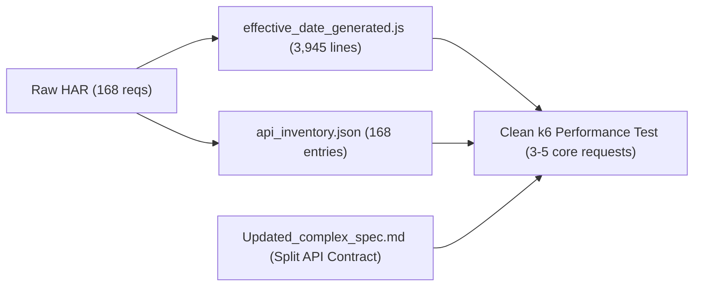

# Request Decisions Document: Effective Date Reassign/Unassign

**Artifact Reference**: `performance/k6/REQUEST_DECISIONS.md`  
**Source HAR**: `performance/har/effective_date_reassign_unassign.har` (168 requests recorded)  
**Inventory Reference**: `performance/analysis/api_inventory.json`  
**Target Test Flow**: Effective Date Unassign and Reassign Operations  

---

## 1. Executive Summary & Critical Recording Findings

> [!CAUTION]
> ### Critical Finding: Business Mutation Missing From HAR Recording
> The recorded HAR captured 168 HTTP requests. Detailed inspection confirms there are **only 5 POST requests** and **zero PUT / PATCH / DELETE requests**:
> - Requests `#24`, `#29`, `#30`: Authentication & MFA verification.
> - Requests `#125`, `#164`: Commute distance calculations (`/api/settings/distance/calculate`), which failed with HTTP `400`.
>
> **What was actually recorded:**
> The session logs in, navigates to the schedule view, queries the schedule grid and board, and **opens the assignment details drawer for two assignments** (`ANN ZUKOSKI` / Assignment `45238d0e-...`, and `JON BLAND` / Assignment `5b4c09a2-...`).
>
> **What is missing:**
> The browser recording was stopped before the operator clicked "Unassign" or "Reassign", selected an Effective Date, or confirmed the modal. Consequently, the actual business mutation endpoint (`POST /api/workforce/scheduling/assignments/:id/split` as specified in `Updated_complex_spec.md`) was **never captured in the HAR**.
>
> To produce a complete k6 performance test for the Effective Date feature, the mutation request must either be added synthetically based on the API contract or re-captured in a new HAR.

---

## 2. Decision Matrix for Relevant Requests

The table below documents every relevant API request captured in the HAR, providing the classification, decision (`KEEP`, `REMOVE`, or `INVESTIGATE`), technical rationale, and associated business operation.

*(All credentials, session cookies, MFA codes, and authorization secrets have been masked/redacted per security policies).*

### Group A: Authentication & Session Initialization

| HAR # | Method | Endpoint / Path | Classification | Decision | Business Operation | Reason / Rationale |
| :---: | :---: | :--- | :--- | :---: | :--- | :--- |
| **2** | `GET` | `/login` | `AUTH` | **REMOVE** | User Authentication | HTML document request for the login UI. Irrelevant for API load testing. |
| **21** | `GET` | `/api/auth/config` | `AUTH` | **REMOVE** | Auth Configuration | Static client-side auth configuration fetch. Redundant for VU performance execution. |
| **22** | `GET` | `/api/auth/config` | `AUTH` | **REMOVE** | Auth Configuration | Duplicate fetch of auth config during initial hydration. |
| **24** | `POST` | `/api/session/login` | `AUTH` | **INVESTIGATE** | User Login | Initial credential authentication returning MFA requirement. If authenticating dynamically in `setup()`, KEEP for `setup()` only. Must be REMOVED from the per-VU iteration loop. |
| **25** | `GET` | `/mfa/verify` | `AUTH` | **REMOVE** | MFA Page Load | HTML document page load for MFA prompt. |
| **29** | `POST` | `/api/auth/mfa/send-code` | `AUTH` | **REMOVE** | MFA Challenge | Dispatches 2FA verification email/SMS. Cannot run reliably in high-volume automated load tests. Replace with static session token or mock bypass in non-production environments. |
| **30** | `POST` | `/api/session/mfa-verify` | `AUTH` | **INVESTIGATE** | MFA Session Creation | Exchanges verification code for `cmma_session` cookie. If MFA bypass is configured, keep in `setup()` only; otherwise authenticate via pre-generated session cookie. |

---

### Group B: Initial Dashboard & Global Context

| HAR # | Method | Endpoint / Path | Classification | Decision | Business Operation | Reason / Rationale |
| :---: | :---: | :--- | :--- | :---: | :--- | :--- |
| **44** | `GET` | `/api/dashboard/overview` | `SUPPORTING` | **REMOVE** | Post-login Landing | Dashboard overview widgets loaded on default redirect. Irrelevant to the scheduling/assignment workflow. |
| **45** | `GET` | `/api/dashboard/comments` | `SUPPORTING` | **REMOVE** | Post-login Landing | Dashboard activity feed comments. Irrelevant to assignment splitting. |
| **46** | `GET` | `/api/users/me/preferences` | `SUPPORTING` | **REMOVE** | User Preferences | Fetches UI display settings (theme, time format). Negligible impact on scheduling load. |
| **47** | `GET` | `/api/resource-trades?includeNonRequestable=false` | `SUPPORTING` | **REMOVE** | Metadata Lookup | Initial lookup of trade classifications on dashboard load. Handled in scheduling view. |
| **48** | `GET` | `/api/workforce?limit=1` | `SUPPORTING` | **REMOVE** | System Check | Lightweight probe to check workforce data availability. |
| **49** | `GET` | `/api/system/labels` | `SUPPORTING` | **REMOVE** | Custom Labels | Custom terminology definitions for the UI. Static configuration, not part of test load. |
| **59** | `GET` | `/api/workforce/assignment-change-requests?status=PENDING&limit=10` | `BUSINESS_READ` | **REMOVE** | Notification Polling | Polls pending change request count for navigation badge. Auxiliary background noise. |
| **60** | `GET` | `/api/workforce/saved-views?featureKey=all` | `SUPPORTING` | **REMOVE** | View Preferences | Fetches user's saved filter views across all pages. Not part of core assignment workflow. |

---

### Group C: Scheduling View & Board Hydration (Preconditions)

| HAR # | Method | Endpoint / Path | Classification | Decision | Business Operation | Reason / Rationale |
| :---: | :---: | :--- | :--- | :---: | :--- | :--- |
| **113** | `GET` | `/api/workforce/assignments/schedule-grid?startDate=2026-09-01&endDate=2026-12-08` | `BUSINESS_READ` | **KEEP** | Schedule Grid View | Primary schedule grid query returning assignments and trade roles. Essential realistic precursor before selecting an assignment. |
| **114** | `GET` | `/api/resource-trades?includeNonRequestable=false` | `SUPPORTING` | **REMOVE** | Trade Filter Lookup | Trade taxonomy lookup. Cacheable reference data; omit from tight mutation loop. |
| **115** | `GET` | `/api/projects?limit=10000` | `SUPPORTING` | **REMOVE** | Project List Lookup | Fetches 10,000 project entries for client-side dropdowns. High payload size; should not be re-requested per transaction. |
| **116** | `GET` | `/api/workforce/assignments/board?startDate=2026-09-01&endDate=2026-12-08` | `BUSINESS_READ` | **KEEP** | Assignment Board View | Core board query returning assignment cards and project allocation status. Key read workload component. |
| **117** | `GET` | `/api/workforce/saved-views?featureKey=workforce-schedule` | `SUPPORTING` | **REMOVE** | Schedule Filter View | Fetches user custom saved filters for schedule board. Auxiliary UI preference. |
| **119** | `GET` | `/api/workforce/assignments/schedule-grid?startDate=2026-09-01&endDate=2026-12-08` | `BUSINESS_READ` | **REMOVE** | Duplicate View Query | Duplicate request fired immediately after #113 due to React StrictMode / double mounting. Keep only single read (#113). |
| **120** | `GET` | `/api/resource-trades?includeNonRequestable=false` | `SUPPORTING` | **REMOVE** | Duplicate Filter Lookup | Duplicate of #114. |
| **121** | `GET` | `/api/projects?limit=10000` | `SUPPORTING` | **REMOVE** | Duplicate Project Lookup | Duplicate of #115. |
| **122** | `GET` | `/api/workforce/assignments/board?startDate=2026-09-01&endDate=2026-12-08` | `BUSINESS_READ` | **REMOVE** | Duplicate View Query | Duplicate of #116 due to React double-fetch. |
| **123** | `GET` | `/api/workforce/saved-views?featureKey=workforce-schedule` | `SUPPORTING` | **REMOVE** | Duplicate View Lookup | Duplicate of #117. |

---

### Group D: Assignment 1 Drawer Interaction (Worker: ANN ZUKOSKI)

| HAR # | Method | Endpoint / Path | Classification | Decision | Business Operation | Reason / Rationale |
| :---: | :---: | :--- | :--- | :---: | :--- | :--- |
| **124** | `GET` | `/api/workforce/b1936c57-fa90-4413-8bb0-0a433f49ab57` | `SUPPORTING` | **INVESTIGATE** | Open Assignment Drawer | Fetches full profile for Worker #923. Can be kept if simulating end-to-end user drawer opening prior to split. |
| **125** | `POST` | `/api/settings/distance/calculate` | `SUPPORTING` | **REMOVE** | Commute Calculation | UI utility computing distance between worker address and project site. Failed with 400 (missing coordinates). NOT a business mutation. |
| **126** | `GET` | `/api/workforce/assignments/45238d0e-36a9-4eb6-833c-160a28d12103/change-requests/pending` | `BUSINESS_READ` | **KEEP** | Assignment Status Check | Verifies if pending change requests exist for assignment `45238d0e-...`. Required UI safety check before mutating. |
| **127** | `GET` | `/api/workforce/comments/ASSIGNMENT/45238d0e-36a9-4eb6-833c-160a28d12103` | `BUSINESS_READ` | **KEEP** | Assignment Comments Read | Retrieves comment thread for the assignment inside the drawer. |
| **128** | `GET` | `/api/workforce/comments/ASSIGNMENT/45238d0e-36a9-4eb6-833c-160a28d12103` | `BUSINESS_READ` | **REMOVE** | Duplicate Comment Read | Frontend re-render artifact. Duplicate of #127. |
| **129** | `GET` | `/api/workforce/comments/ASSIGNMENT/45238d0e-36a9-4eb6-833c-160a28d12103` | `BUSINESS_READ` | **REMOVE** | Duplicate Comment Read | Frontend re-render artifact. Duplicate of #127. |

---

### Group E: Assignment 2 Drawer Interaction (Worker: JON BLAND)

| HAR # | Method | Endpoint / Path | Classification | Decision | Business Operation | Reason / Rationale |
| :---: | :---: | :--- | :--- | :---: | :--- | :--- |
| **163** | `GET` | `/api/workforce/61f54e4b-d859-49b5-a56d-a18ac3145ce4` | `SUPPORTING` | **INVESTIGATE** | Open Assignment Drawer | Fetches profile for Worker #1571. Secondary assignment inspection in recording. |
| **164** | `POST` | `/api/settings/distance/calculate` | `SUPPORTING` | **REMOVE** | Commute Calculation | Failed with 400. Auxiliary UI calculation; remove. |
| **165** | `GET` | `/api/workforce/assignments/5b4c09a2-da1e-4d05-91ee-225381fc8078/change-requests/pending` | `BUSINESS_READ` | **REMOVE** | Assignment Status Check | Second assignment inspected. In a clean k6 test, target one parameterized assignment per iteration. |
| **166** | `GET` | `/api/workforce/comments/ASSIGNMENT/5b4c09a2-da1e-4d05-91ee-225381fc8078` | `BUSINESS_READ` | **REMOVE** | Assignment Comments Read | Second assignment comments. |
| **167** | `GET` | `/api/workforce/comments/ASSIGNMENT/5b4c09a2-da1e-4d05-91ee-225381fc8078` | `BUSINESS_READ` | **REMOVE** | Duplicate Comment Read | Duplicate of #166. |
| **168** | `GET` | `/api/workforce/comments/ASSIGNMENT/5b4c09a2-da1e-4d05-91ee-225381fc8078` | `BUSINESS_READ` | **REMOVE** | Duplicate Comment Read | Duplicate of #166. |

---

### Group F: Static Assets, Third-Party, & Next.js RSC Calls

| HAR Range | Item Count | Classification | Decision | Reason / Rationale |
| :--- | :---: | :--- | :---: | :--- |
| **`#3–19`, `#26–28`, `#32–43`, `#68`, `#72–75`, `#79–83`, `#87–89`, `#93–97`, `#101–107`, `#110–112`, `#118`** | 62 | `STATIC` | **REMOVE** | Bundled JavaScript chunks (`/_next/static/chunks/*.js`), CSS stylesheets, and favicons. Load testing CDN/static assets distorts API backend performance metrics. |
| **`#23`** | 1 | `THIRD_PARTY` | **REMOVE** | External Azure Blob Storage asset (`cmmadev.blob.core.windows.net/logo-uploads/...`). Must never be load tested. |
| **`#1`, `#50–58`, `#61–67`, `#69–71`, `#76–78`, `#84–86`, `#90–92`, `#98–100`, `#108–109`, `#130–162`** | 70 | `SUPPORTING` | **REMOVE** | Next.js HTML page transitions and App Router React Server Component prefetch requests (`?_rsc=...` for `/settings`, `/admin`, `/insights`, `/reports`, `/scheduling`, `/resources`, `/projects`). Pure frontend routing overhead. |

---

### Group G: Missing Business Mutation (Must Be Added to k6)

| Expected Method | Target Endpoint | Classification | Decision | Business Operation | Reason / Implementation Guide |
| :---: | :--- | :--- | :---: | :--- | :--- |
| `POST` | `/api/workforce/scheduling/assignments/{id}/split` | `BUSINESS_MUTATION` | **ADD / KEEP** | **Unassign Worker at Effective Date** | **Critical Target Action**: Splits assignment at `splitDate`. Shortens original record and generates open labor request. Payload: `{"splitMode":"date","splitDate":"2026-08-16","version":<ver>,"targetWorkerId":null,"overrideConflict":false,"overrideHistoricLockout":false}` |
| `POST` | `/api/workforce/scheduling/assignments/{id}/split` | `BUSINESS_MUTATION` | **ADD / KEEP** | **Reassign Worker at Effective Date** | **Critical Target Action**: Splits assignment at `splitDate`. Reassigns remainder to replacement worker. Payload: `{"splitMode":"date","splitDate":"2026-08-16","version":<ver>,"targetWorkerId":"<worker-uuid>","overrideConflict":false,"overrideHistoricLockout":false}` |

---

## 3. Correlation with Existing Artifacts

### Comparison Summary

1. **`effective_date_reassign_unassign.har`**:
   - Contains 168 entries, but 133 are static/Next.js assets and 24 are duplicate/dashboard reads.
   - Stops immediately after opening assignment side drawers; missing the split mutation.
2. **`api_inventory.json`**:
   - Accurately captures every entry by method, status, and path.
   - Incorrectly labels `#125` and `#164` as `MUTATION_CANDIDATE` based purely on `POST` method; these are distance calculations that return 400.
3. **`effective_date_generated.js`**:
   - Naively executes all 168 requests including all 62 static chunks, 70 Next.js `_rsc` calls, and login/MFA steps.
   - Replaying this file will not test the Effective Date feature because the mutation does not exist in it.

---

## 4. Final Recommended Request Flow for k6

To construct a realistic, clean, and maintainable k6 performance test for Effective Date Reassign/Unassign, the test script should be trimmed to the following minimal sequence:

### Phase 1: Authentication (`setup` lifecycle hook)
- Run once before VU execution:
  - Either acquire `cmma_session` cookie via login or read from environment variable `__ENV.SESSION_COOKIE`.
  - Pass the authenticated session and target assignment/worker pool to the default VU function.

### Phase 2: VU Iteration Workflow (The Performance Measurement)
1. **Load Schedule Context** (`BUSINESS_READ`):
   - `GET /api/workforce/assignments/schedule-grid?startDate=${START}&endDate=${END}` (`#113`)
   - `GET /api/workforce/assignments/board?startDate=${START}&endDate=${END}` (`#116`)
2. **Verify Pending Status** (`BUSINESS_READ`):
   - `GET /api/workforce/assignments/${assignmentId}/change-requests/pending` (`#126`)
3. **Execute Split Mutation** (`BUSINESS_MUTATION` — Synthesized from Spec):
   - `POST /api/workforce/scheduling/assignments/${assignmentId}/split`
     - **For Unassign**: `targetWorkerId: null`
     - **For Reassign**: `targetWorkerId: "${targetWorkerId}"`
4. **Post-Mutation Read / Verification** (Optional Read Verification):
   - `GET /api/workforce/assignments/schedule-grid?startDate=${START}&endDate=${END}`
