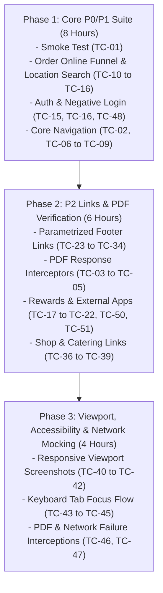

# Automation Feasibility Assessment: Steak 'n Shake Home Navigation (`002-steaknshake-home`)

## Executive Summary
- **Feature Name**: Steak 'n Shake Home Navigation
- **Feature Branch**: `002-steaknshake-home`
- **Primary Source Specifications**: [`specs/002-steaknshake-home/spec.md`](file:///c:/Users/costrategix/SpecKit_Learning/specs/002-steaknshake-home/spec.md)
- **Reviewed Test Cases Source**: [`output/test_cases/002-steaknshake-home-test-cases.md`](file:///c:/Users/costrategix/SpecKit_Learning/output/test_cases/002-steaknshake-home-test-cases.md) & [`output/test_case_reviews/002-steaknshake-home-review.md`](file:///c:/Users/costrategix/SpecKit_Learning/output/test_case_reviews/002-steaknshake-home-review.md)
- **Recommended Automation Stack**: **Python + Playwright** (`pytest-playwright`)

---

## 1. Automation Strategy & Framework Justification

### Recommended Stack: **Python + Playwright**
- **Multi-Tab & Context Support**: Playwright provides native `context.expect_page()` event handling, making verification of external links opening in new browser tabs (e.g. Franchise site, Google Play, App Store) effortless and reliable.
- **PDF & Network Interception**: Playwright's `page.expect_response()` and `page.route()` APIs allow inspecting PDF HTTP header responses (`application/pdf`) and mocking network failures (e.g. PDF load failures, offline external links) without third-party plugins.
- **Viewport Emulation**: Built-in mobile device emulation (`playwright.devices`) enables rapid verification of desktop and mobile banner responsive viewports.
- **Speed & Isolation**: Isolated browser contexts ensure fast, parallel execution across cross-browser engines (Chromium, Firefox, WebKit).

---

## 2. Automation Feasibility Assessment Matrix

| Candidate ID & Title | Recommendation | Priority | Complexity | Framework | Justification & Technical Approach |
|---|---|---|---|---|---|
| **TC-01**: `[Positive][P1][FR-001]` - Verify Steak 'n Shake home page loads successfully | **Automate** | P0 | Low | Python + Playwright | Core smoke test. Basic page navigation, title check, and top header/logo locator visibility assertion. |
| **TC-02**: `[Positive][P1][FR-002]` - Verify MENU section options and PDF access points are visible | **Automate** | P1 | Low | Python + Playwright | Hover/click MENU dropdown and assert element visibility for Printable Menu, Allergens, and Nutrition links. |
| **TC-03**: `[Positive][P1][FR-003]` - Verify Printable Menu link opens PDF containing menu items list | **Automate** | P1 | Medium | Python + Playwright | Intercept network response (`expect_response`) or download event; verify HTTP 200 and `application/pdf` Content-Type header. |
| **TC-04**: `[Positive][P1][FR-004]` - Verify Ingredients and Allergens link opens PDF with allergen information | **Automate** | P1 | Medium | Python + Playwright | Intercept network response; assert HTTP 200 status code and `application/pdf` header. |
| **TC-05**: `[Positive][P1][FR-005]` - Verify Nutrition Facts link opens PDF containing nutrition details | **Automate** | P1 | Medium | Python + Playwright | Intercept network response; assert HTTP 200 status code and valid non-zero PDF body response. |
| **TC-06**: `[Positive][P1][FR-006]` - Verify SPECIALS Half Price Happy Hour navigation | **Automate** | P1 | Low | Python + Playwright | Click Specials sub-menu link and assert `page.url` contains `/menu_specials/half-price-happy-hour/`. |
| **TC-07**: `[Positive][P1][FR-007]` - Verify ABOUT US navigation loads about-us page | **Automate** | P1 | Low | Python + Playwright | Click About Us link and assert `page.url` contains `/about-us/` and heading locator is visible. |
| **TC-08**: `[Positive][P1][FR-008]` - Verify clicking SteaknShake logo returns user to home page | **Automate** | P1 | Low | Python + Playwright | Navigate to subpage, click logo selector, and assert `page.url` returns to root domain. |
| **TC-09**: `[Positive][P1][FR-009]` - Verify FRANCHISE link opens external site in a new browser tab | **Automate** | P1 | Medium | Python + Playwright | Use `with context.expect_page() as new_tab_info:` to capture popup tab and verify URL equals `http://www.steaknshakefranchise.com/`. |
| **TC-10**: `[Positive][P1][FR-010]` - Verify Order Online button navigates to order-online page | **Automate** | P0 | Low | Python + Playwright | Core ordering funnel entry point. Click Order Online and assert `page.url` contains `/order-online/`. |
| **TC-11**: `[Positive][P1][FR-011]` - Verify location search field accepts query and triggers search results | **Automate** | P0 | Medium | Python + Playwright | Input text `Cincinnati`, click search icon, and assert location result cards locator count > 0. |
| **TC-12**: `[Negative][P2][FR-029]` - Verify location search displaying no-results message for invalid location | **Automate** | P2 | Low | Python + Playwright | Input `XYZ999NonExistentCity`, click search, and assert visible empty-state container text locator. |
| **TC-13**: `[Positive][P1][FR-012]` - Verify successful location search displays selectable restaurant and Order action | **Automate** | P0 | Medium | Python + Playwright | Execute search and assert restaurant card locator contains address details and an enabled "Order" button. |
| **TC-14**: `[Positive][P1][FR-013]` - Verify clicking restaurant Order button opens location menu ordering page | **Automate** | P0 | Medium | Python + Playwright | Click restaurant Order button and assert location-specific ordering menu URL and store header context. |
| **TC-15**: `[Positive][P1][FR-014]` - Verify Login control in ordering flow is enabled and opens login page | **Automate** | P1 | Low | Python + Playwright | Click Login button in ordering header and assert login modal/page container locator visibility. |
| **TC-16**: `[Positive][P1][FR-015]` - Verify valid login authentication in ordering flow returns user to restaurant order context | **Automate** | P0 | Medium | Python + Playwright | Enter valid test credentials, submit form, and assert authenticated session header/profile controls. |
| **TC-17**: `[Positive][P2][FR-018]` - Verify Rewards page loads and displays rewards content and links | **Automate** | P2 | Low | Python + Playwright | Click Rewards link and assert page title, promotional banner locator, and child link locators. |
| **TC-18**: `[Positive][P2][FR-019]` - Verify rewards FAQ link navigates to rewards FAQ page | **Automate** | P2 | Low | Python + Playwright | Click Rewards FAQ link and assert `page.url` matches `https://www.steaknshake.com/rewards-faq/`. |
| **TC-19**: `[Positive][P2][FR-020]` - Verify Google Play icon opens Android app store in a new tab | **Automate** | P2 | Medium | Python + Playwright | Capture new tab via `context.expect_page()` and assert target URL matches Google Play app listing. |
| **TC-20**: `[Positive][P2][FR-021]` - Verify App Store icon opens Apple app store in a new tab | **Automate** | P2 | Medium | Python + Playwright | Capture new tab via `context.expect_page()` and assert target URL matches Apple App Store listing. |
| **TC-21**: `[Positive][P2][FR-022]` - Verify Join Now link navigates to signup page | **Automate** | P2 | Low | Python + Playwright | Click Join Now and assert `page.url` matches `https://www.steaknshake.com/signup/`. |
| **TC-22**: `[Positive][P2][FR-023]` - Verify Sign In link navigates to login page | **Automate** | P2 | Low | Python + Playwright | Click Sign In link on rewards page and assert `page.url` matches `https://www.steaknshake.com/login/`. |
| **TC-23**: `[Positive][P2][FR-016]` - Verify footer navigation links are visible and interactive | **Automate** | P2 | Low | Python + Playwright | Scroll footer into view (`scroll_into_view_if_needed`) and assert footer navigation links count and visibility. |
| **TC-24**: `[Positive][P2][FR-016]` - Verify footer Rewards Club link navigates to rewards page | **Automate** | P2 | Low | Python + Playwright | Click footer Rewards link and assert target rewards URL. Easily parametrized with Pytest. |
| **TC-25**: `[Positive][P2][FR-016]` - Verify footer Shop link navigates to external shop site | **Automate** | P2 | Low | Python + Playwright | Click footer Shop link and assert `page.url` matches `https://www.shopsteaknshake.com/`. |
| **TC-26**: `[Positive][P2][FR-016]` - Verify footer Careers link navigates to corporate careers portal | **Automate** | P2 | Low | Python + Playwright | Click footer Careers link and assert URL matches `https://recruiting.talentreef.com/steak-n-shake-corporate`. |
| **TC-27**: `[Positive][P2][FR-016]` - Verify footer Feedback link navigates to customer pulse page | **Automate** | P2 | Low | Python + Playwright | Click footer Feedback link and assert `page.url` contains `https://www.customerpulse.net/`. |
| **TC-28**: `[Positive][P2][FR-016]` - Verify footer Associates link navigates to associates careers page | **Automate** | P2 | Low | Python + Playwright | Click footer Associates link and assert `page.url` contains `/careers/`. |
| **TC-29**: `[Positive][P2][FR-016]` - Verify footer Terms of Use link navigates to Terms of Use page | **Automate** | P2 | Low | Python + Playwright | Click footer Terms of Use link and assert `page.url` contains terms path fragment. |
| **TC-30**: `[Positive][P2][FR-016]` - Verify footer Privacy link navigates to privacy policy page | **Automate** | P2 | Low | Python + Playwright | Click footer Privacy link and assert `page.url` contains `/privacy/`. |
| **TC-31**: `[Positive][P2][FR-016]` - Verify footer Site Map link loads sitemap XML | **Automate** | P2 | Medium | Python + Playwright | Click Site Map link or issue `page.request.get()` and assert HTTP status 200 and XML content type. |
| **TC-32**: `[Positive][P2][FR-016]` - Verify footer Our Animal Wellbeing Standard link navigates to wellbeing standards page | **Automate** | P2 | Low | Python + Playwright | Click link and assert `page.url` contains wellbeing standards path fragment. |
| **TC-33**: `[Positive][P2][FR-016]` - Verify footer Accessibility Statement link navigates to accessibility statement page | **Automate** | P2 | Low | Python + Playwright | Click link and assert `page.url` contains accessibility statement path fragment. |
| **TC-34**: `[Positive][P2][FR-016]` - Verify footer Biglari Holdings Company link navigates to Biglari Holdings homepage | **Automate** | P2 | Low | Python + Playwright | Click link and assert `page.url` matches `http://www.biglariholdings.com/`. |
| **TC-35**: `[Positive][P2][FR-017]` - Verify footer social media icons navigate to respective external social media pages | **Partially Automate** | P2 | Medium | Python + Playwright | Automate verifying social icon `href` attributes and target domain URL navigation. Keep deep external social DOM assertions manual to avoid third-party bot/login wall flakiness. |
| **TC-36**: `[Positive][P3][FR-024]` - Verify Beef Tallow shop item link navigates to beeftallow store | **Automate** | P2 | Low | Python + Playwright | Click Beef Tallow shop link and assert `page.url` matches `https://beeftallow.steaknshake.com/`. |
| **TC-37**: `[Positive][P3][FR-024]` - Verify Hats shop item link navigates to hats store | **Automate** | P2 | Low | Python + Playwright | Click Hats shop link and assert `page.url` matches `https://hats.steaknshake.com/`. |
| **TC-38**: `[Positive][P3][FR-025]` - Verify Seed Oil header link navigates to seed-oils page | **Automate** | P2 | Low | Python + Playwright | Click Seed Oil header link and assert `page.url` matches `https://www.steaknshake.com/seed-oils/`. |
| **TC-39**: `[Positive][P3][FR-026]` - Verify Catering link navigates to catering ordering site | **Automate** | P2 | Low | Python + Playwright | Click Catering link and assert `page.url` matches `https://order.steaknshakecatering.com/`. |
| **TC-40**: `[Responsive][P3][FR-027]` - Verify hero banners layout and legibility on desktop viewport | **Partially Automate** | P2 | Medium | Python + Playwright | Automate viewport configuration (`1920x1080`), banner visibility, and visual snapshot comparison (`expect(page).to_have_screenshot()`). Subjective legibility evaluation remains manual. |
| **TC-41**: `[Responsive][P3][FR-027]` - Verify hero banners layout and legibility on mobile viewport | **Partially Automate** | P2 | Medium | Python + Playwright | Automate mobile viewport emulation (`375x667`) and container overflow check. Subjective aesthetic legibility remains manual. |
| **TC-42**: `[Responsive][P3][FR-016]` - Verify footer links remain accessible without overlap on small mobile viewport | **Partially Automate** | P2 | Medium | Python + Playwright | Automate viewport (`320x568`), scroll into view, and element clickability assertions. Visual overlap inspection remains manual. |
| **TC-43**: `[Accessibility][P2][FR-028]` - Verify keyboard navigation and focus indicators across main header links | **Automate** | P2 | Medium | Python + Playwright | Automate keyboard `Tab` key presses and assert focus state selector `page.locator(':focus')`. |
| **TC-44**: `[Accessibility][P2][FR-028]` - Verify keyboard accessibility for footer and responsive banner controls | **Automate** | P2 | Medium | Python + Playwright | Automate `Tab` navigation through footer elements and assert focus progression without focus traps. |
| **TC-45**: `[Accessibility][P2][FR-028]` - Verify PDF document links are properly labeled for assistive technology | **Automate** | P2 | Low | Python + Playwright | Inspect DOM locator attributes (`aria-label`, `title`, or text content) for PDF links. |
| **TC-46**: `[Edge Case][P3][Edge Case]` - Verify graceful handling when a PDF resource fails to load | **Automate** | P2 | Medium | Python + Playwright | Use Playwright `page.route()` to intercept PDF URL and respond with HTTP 500/404 to verify UI non-crash behavior. |
| **TC-47**: `[Edge Case][P3][FR-030]` - Verify browser level error notification when an external target URL is unreachable | **Automate** | P2 | Medium | Python + Playwright | Use `page.route()` to abort external request (`route.abort('failed')`) and verify primary application tab stability. |
| **TC-48** *(Review Gap 1)*: `[Negative][P1][FR-015]` - Verify order flow login failure with invalid credentials | **Automate** | P1 | Low | Python + Playwright | Fill invalid email/password, submit login, and assert visible error message locator (e.g. "Invalid credentials"). |
| **TC-49** *(Review Gap 2)*: `[Validation][P2][FR-011]` - Verify submitting empty or whitespace location search string | **Automate** | P2 | Low | Python + Playwright | Clear search field or enter spaces, trigger search, and assert validation message or zero API network trigger. |
| **TC-50** *(Review Gap 3)*: `[Positive][P2][FR-017]` - Verify footer Facebook icon opens official Facebook page | **Automate** | P2 | Low | Python + Playwright | Assert Facebook icon `href` locator attribute contains `facebook.com/steaknshake`. |
| **TC-51** *(Review Gap 4)*: `[Positive][P2][FR-017]` - Verify footer Instagram icon opens official Instagram page | **Automate** | P2 | Low | Python + Playwright | Assert Instagram icon `href` locator attribute contains `instagram.com/steaknshake`. |

---

## 3. Automation Summary & Implementation Metrics

### Quantitative Metrics

| Metric | Count | Percentage |
|---|---|---|
| **Total Candidates Evaluated** | **51** | **100%** |
| **Recommended for Full Automation** | **47** | **92.2%** |
| **Recommended for Partial Automation** | **4** | **7.8%** |
| **Keep Manual Only** | **0** | **0.0%** |

### Priority Breakdown for Automation Implementation

- **P0 (Critical Smoke / Core Ordering Regression)**: 6 Candidates (11.8%)
- **P1 (High Business Value Navigation & Auth)**: 12 Candidates (23.5%)
- **P2 (Secondary Links, Accessibility & Edge Cases)**: 33 Candidates (64.7%)
- **P3 (Manual Only)**: 0 Candidates (0%)

### Implementation Complexity Breakdown

- **Low Complexity** (Simple link clicks, URL assertions, basic locator visibility): **33 Candidates (64.7%)**
- **Medium Complexity** (Multi-tab context, network interception, PDF verification, viewport emulation, keyboard focus): **18 Candidates (35.3%)**
- **High Complexity**: **0 Candidates (0%)**

---

## 4. Maintenance & High-Risk Areas

1. **Third-Party External Links**:
   - *Risk*: External domains (e.g. Talentreef, CustomerPulse, Biglari, App Stores) may change URL structures or experience external downtime.
   - *Mitigation*: Prefer asserting `href` attributes or initial HTTP status/domain redirection rather than asserting third-party page internal DOM content.
2. **PDF Resource Downloads**:
   - *Risk*: Direct PDF browser rendering varies across headless browser engines.
   - *Mitigation*: Validate PDF endpoints via Playwright API request contexts (`page.request.get()`) or network response headers (`application/pdf`) rather than attempting PDF canvas OCR.
3. **Location Search Dynamic Results**:
   - *Risk*: Store location database content may change per environment.
   - *Mitigation*: Parametrize test location data (`Cincinnati`) and assert structural locator traits (e.g. store card container visibility, active Order button) rather than hardcoded store IDs.

---

## 5. Automation Implementation Roadmap

- **Estimated Total Implementation Effort**: ~18 Hours
